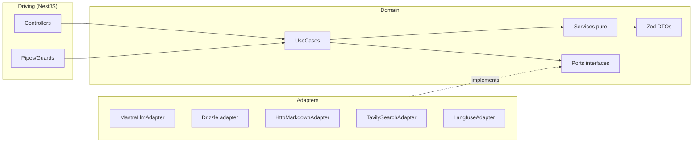
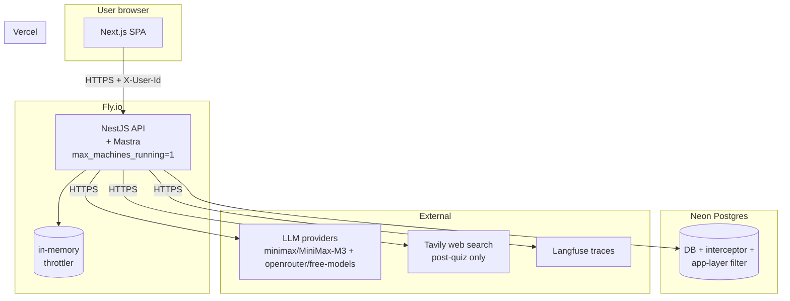
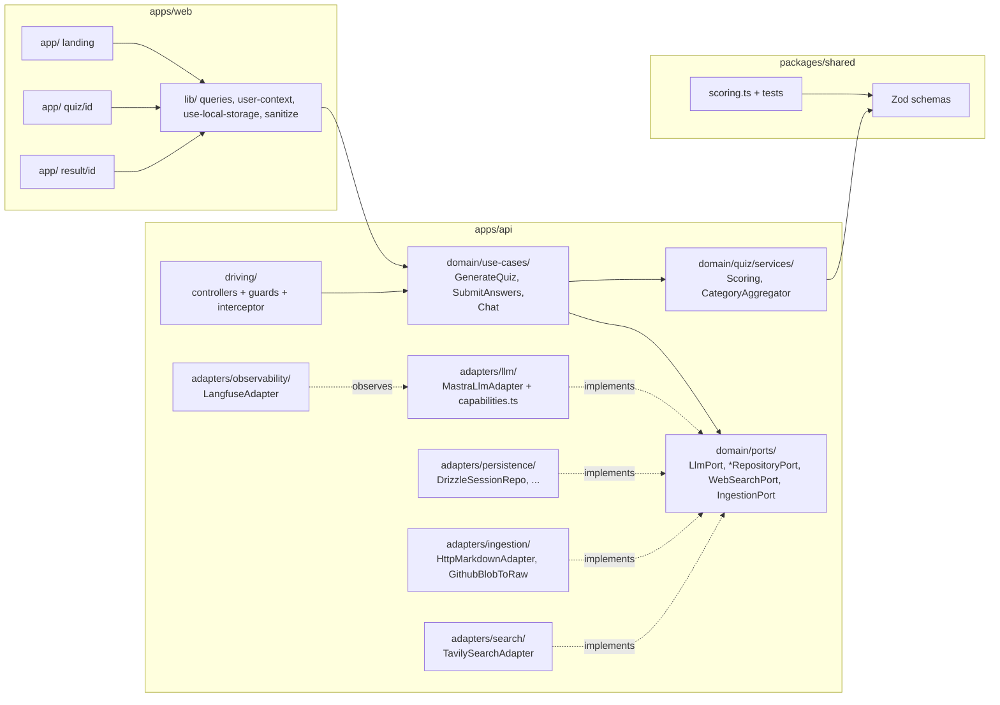
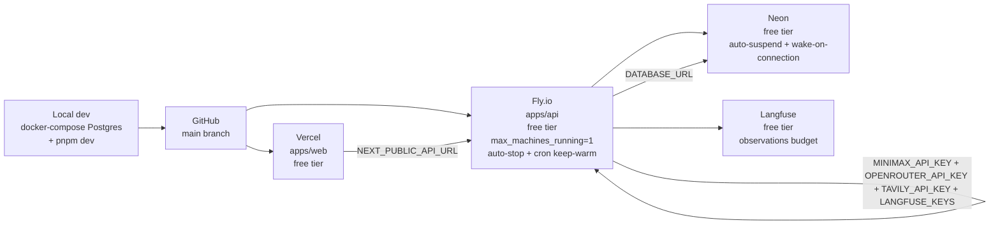

# Architecture Spine — ai-quiz

The invariant contract that all downstream epics and stories inherit verbatim. **29 live ADs** (+ AD-N6 retained as a tombstone; AD-11 removed outright) distilled from the **audited PRD** (`prds/prd-ai-quiz-2026-07-16/prd.md`) + the implementation reference (`specs/architecture-spec.md`) + the constitution (`project-context.md`) + this run's `.memlog.md` (84 entries, the authority).

**Re-distilled 2026-07-19.** Two load-bearing changes since the 2026-07-18 regen, plus a residue purge:

1. **Question pool replaces category pool** (AD-N4, AD-N2, AD-N1, AD-4). The old design was _unexecutable_: AD-N2 mandates one LLM call, but AD-N4 required the system to randomly select categories **between** the model proposing a category pool and the model generating questions — a round trip, i.e. two calls. The single call now returns a **pool of category-tagged questions**; validation, category selection, and stratified sampling are pure post-call system steps.
2. **RLS was broken for two cases** (AD-9, found by `review-r3`). Session creation had no GUC path, so the first `INSERT` of every session would be rejected under `FORCE ROW LEVEL SECURITY`; and the `answers` policy was unwritable as specified because that table has no `session_id`.

The SPEC archive at `_bmad-output/archive/SPEC-2026-07-16.md` is **frozen and not authoritative**. The PRD wins on any conflict.

## Design Paradigm

**Hexagonal architecture (a.k.a. ports-and-adapters)** for the API; **MVC-by-feature** for the web.

The API's dependency direction is the load-bearing rule: domain → ports → use-cases, with adapters and the NestJS driving layer as the only callers into the domain. Every cross-boundary value is a Zod-inferred DTO, frozen at construction. The web follows Next.js App Router conventions; LLM-bearing logic lives only in the API, never in the browser bundle.

API layers:

| Layer            | Path                             | Imports allowed                         | Imports forbidden                             |
| ---------------- | -------------------------------- | --------------------------------------- | --------------------------------------------- |
| domain           | `apps/api/src/domain/`           | other domain code, Zod, type-only       | NestJS, Drizzle, Mastra, undici, `node:fetch` |
| ports            | `apps/api/src/domain/ports/`     | domain types, Zod                       | adapters, NestJS                              |
| use-cases        | `apps/api/src/domain/use-cases/` | domain + ports + Zod                    | adapters, NestJS                              |
| adapters         | `apps/api/src/adapters/`         | port interfaces + external SDKs         | domain internals                              |
| driving (NestJS) | `apps/api/src/driving/`          | use-cases + adapters (composition root) | domain internals                              |

Web layers:

| Layer       | Path                     | Responsibility                                 |
| ----------- | ------------------------ | ---------------------------------------------- |
| app/        | Next.js App Router pages | Routing + composition                          |
| components/ | React components         | UI + presentation logic                        |
| lib/        | Hooks + utilities        | API wrapper, query factory, contexts, sanitize |



## Inherited Invariants

None — this is the root spine at `initiative` altitude. Downward epics/stories inherit these ADs verbatim.

## Invariants & Rules

> **Binds** = the FR/NFR this AD governs. **Prevents** = the divergence this AD stops. **Rule** = the constraint downstream must follow.

### AD-1 — Hexagonal Architecture `[ADOPTED]`

- **Binds:** `apps/api/src/*` (entire backend); all 15 active FRs (FR-1..17 minus FR-12, FR-13).
- **Prevents:** domain logic coupled to NestJS/Drizzle/Mastra; cross-boundary types duplicated.
- **Rule:** `domain/`, `ports/`, `use-cases/` are pure; `adapters/` and `driving/` hold all I/O.

### AD-2 — Domain purity `[ADOPTED]`

- **Binds:** `apps/api/src/domain/*` + all use-cases.
- **Prevents:** I/O leaking into pure logic; tests becoming slow/integration-y.
- **Rule:** Enforced by ESLint `no-restricted-imports` against `@nestjs/*`, `drizzle-orm`, `mastra`, `undici`, `node:fetch`. The domain is an isolated **directory** (`apps/api/src/domain/`) with its own `tsconfig.json` — not a separate pnpm package. Domain code may not import from `apps/api/src/adapters/`, `apps/api/src/driving/`, or any external I/O library. Vitest in-domain unit tests must run in <100ms (no I/O).

### AD-3 — Zod DTOs at every boundary (canonical pattern)

- **Binds:** HTTP→domain, domain→adapter, adapter→domain.
- **Prevents:** `any`/`unknown` leaking across layers; runtime shape drift; domain code coupled to drizzle/raw types; silent shape drift between DB columns and Zod schemas.
- **Rule (canonical adapter-method pattern):** Every adapter wraps raw I/O results in `Object.freeze(Schema.parse(raw))` before returning. Domain code never sees raw `unknown`, raw drizzle types, or unvalidated shapes. The schema used is the Zod schema for that entity from `packages/shared/src/schemas.ts`.

```ts
// adapters/persistence/drizzle/sessionRepo.ts
import { eq, and } from 'drizzle-orm';
import { QuizSessionSchema, type QuizSessionDto } from '@ai-quiz/shared/schemas';
import type { SessionRepositoryPort } from 'domain/ports/sessionRepositoryPort';

export class DrizzleSessionRepository implements SessionRepositoryPort {
  async findByIdAndUserId(sessionId: string, userId: string): Promise<QuizSessionDto | null> {
    const rows = await this.db
      .select()
      .from(quizSessions)
      .where(and(eq(quizSessions.id, sessionId), eq(quizSessions.userId, userId)))
      .limit(1);
    if (rows.length === 0) return null;
    // ← parse + freeze happens INSIDE the adapter, before returning
    return Object.freeze(QuizSessionSchema.parse(rows[0]));
  }
}
```

- **Direction:** raw I/O (drizzle rows, HTTP request bodies, LLM JSON responses) crosses the boundary one way only — inbound → parsed → frozen → domain. Domain operates on parsed, frozen DTOs.
- **One schema per boundary:** the Zod schema in `packages/shared/src/schemas.ts` is the single source of truth for the entity's shape. It validates (a) DB rows on read, (b) HTTP bodies on write (via `ZodValidationPipe` in the driving layer), (c) LLM JSON outputs on the LLM adapter side. If the schema changes, all three boundaries change together.
- **Frozen DTOs:** `Object.freeze(...)` is mandatory. Use cases receive `Readonly<DTO>`-equivalent values; any attempt to mutate throws in strict mode. Prevents accidental shared-state bugs.
- **No mapping layer:** the DTO is the universal currency. There is no separate `entities/` layer; we don't map entity ↔ DTO between adapter and domain. (See addendum B for trade-offs and when this pattern breaks down.)
- ⚠️ **"One schema per boundary" means one schema per BOUNDARY, not one schema per entity** _(clarified 2026-07-19)_. A single entity legitimately has **distinct schemas for distinct boundaries**, and conflating them causes concrete failures:
  - **Row schema ≠ request schema.** `QuizSessionSchema` doing double duty is why `costSpent` survived in a `.strict()` schema after the column was dropped (**every session read then throws at the adapter boundary**), and why `strategy` reads nullable on a field AD-N4 mandates as REQUIRED. Name them distinctly (`QuizSessionRowSchema` vs `CreateSessionRequestSchema`).
  - **Wire schema ≠ row schema.** AD-12's pre-submit redaction is **unenforceable** if the outbound DTO is the same object as the row DTO — dropping `is_correct` has to be a _schema-level projection_ (`RedactedQuestionSchema`), not a runtime `delete`, or the guard is one forgotten field away from leaking answers.
  - The rule stays "parse + freeze at every boundary"; what changes is that the _right_ schema is used at each one.

### AD-4 — LLM untrusted

- **Binds:** Every adapter that calls an LLM (FR-2, FR-3, FR-4, FR-9, FR-11, FR-15). _(FR-13 removed 2026-07-19.)_
- **Prevents:** Malformed JSON, refusal strings, injection-shaped strings reaching persistence/UI.
- **Rule:** Zod `safeParse` + **2 retries** (best-effort providers — OpenRouter free models) / **1 retry** (strict-mode — default `minimax/MiniMax-M3`). `UntrustedLlmOutputError` on final failure; session marked `failed`.
- **On the generation path a retry regenerates the WHOLE question pool** (AD-N4 step 2), never a partial top-up. Ollama is out of v1 scope (AD-6) and is not a retry-budget tier.

### AD-5 — LlmPort is the only outbound LLM boundary

- **Binds:** All LLM-touching code.
- **Prevents:** Bypass of capability map, caching, retry, output validation.
- **Rule:** Use-cases never import from `adapters/llm/*` directly. `LlmPort` (`apps/api/src/domain/ports/LlmPort.ts`) is the sole outbound LLM boundary.

### AD-6 — Provider-agnostic via Mastra (with capability matrix) `[AMENDED 2026-07-18]`

- **Binds:** LLM adapter, runtime config, FR-4, FR-14.
- **Prevents:** Hardcoded provider SDK in domain; per-provider auth leaks; missing capability flags.
- **Rule (v1 scope — MiniMax + OpenRouter free):** Two provider tiers. Default is MiniMax-M3; OpenRouter free models are opt-in via the FE dropdown. Model string is `'provider/model'` (e.g. `'minimax/MiniMax-M3'`, `'openrouter/meta-llama/llama-3.3-70b-instruct:free'`). MiniMax wired via inline `url` form (not a built-in Mastra provider); OpenRouter via the built-in Mastra `openrouter` adapter. Provider capability matrix lives in `adapters/llm/capabilities.ts` and governs every LLM call. **Matrix essentials (verified 2026-07-19):**
  - **MiniMax:** model ID is **`MiniMax-M3`** (hyphen, not space). M3 supports **auto caching only** (no explicit `cache_control`); M2.x supports explicit. Round-trip `reasoning_details` via `extra_body={"reasoning_split": true}` (OpenAI-compat) or full `content[]` array with `thinking` + `signature` blocks (Anthropic-compat).
  - **OpenRouter free models:** filtered by `pricing.prompt = "0"`. Example model IDs: `meta-llama/llama-3.3-70b-instruct:free`, `google/gemini-2.0-flash-exp:free`, `qwen/qwen-2.5-72b-instruct:free`, `mistralai/mistral-small-3.1-24b-instruct:free`. Catalog may rotate — capability matrix pulls live list from `https://openrouter.ai/api/v1/models?free=true`.
  - ⚠️ **Transparent fallback is DISABLED on the generation path** _(fix 2026-07-19)_. Free-tier failures fall back to MiniMax-M3 only for **chat**. On generation it must not fire: a mid-flight model swap changes the AD-4 retry budget class (2→1), invalidates the chunk/prompt pairing AD-N4 depends on, and — nested inside the use-case's own retry loop — compounds to **up to 6 LLM calls per request**, blowing the ~30 s ceiling the 1.5× pool was sized to protect. The use-case is the **single retry authority** on generation (AD-N4 step 2).
  - **Default:** `minimax/MiniMax-M3` (flagship; 1M context; auto caching only). `temperature` and `top_p` are **fully supported** on M3.
  - **MiniMax regional:** `MINIMAX_REGION=intl` switches to `api.minimax.io`; mainland China is default (`api.minimaxi.com`).
  - **Provider filtering:** `GET /api/config/providers` returns only providers whose env keys are set. Default-deny. In v1 this returns `{minimax: [...models], openrouter: [...free models]}` when both keys are set; `[]` when neither is set.
  - **Env contract (v1):** `MINIMAX_API_KEY` (enables the default tier) and `OPENROUTER_API_KEY` (enables the opt-in free tier); optional `MINIMAX_REGION=intl` switches the host to `api.minimax.io` (default `api.minimaxi.com`). Both are set via `fly secrets set`. If the OpenRouter live-catalog fetch fails, `GET /api/config/providers` degrades to MiniMax-only rather than returning 5xx. When `providers` is empty the web landing page must show an explicit "no providers configured" state and disable Start (never an empty dropdown behind a live button).

### AD-7 — Mastra catch-all MUST be last

- **Binds:** `apps/api/src/app.module.ts`, FR-4.
- **Prevents:** Catch-all `@All('*')` shadowing all NestJS controllers (returns 404 for every endpoint).
- **Rule:** `MastraModule.register({mastra})` is the last entry in `AppModule.imports`. Integration test asserts every NestJS route resolves. Comment above the import explains the constraint.

### AD-8 — Runtime constraints `[ADOPTED]`

- **Binds:** `apps/api` runtime, deploy target.
- **Prevents:** Mastra integration failure; silent Fastify incompatibility.
- **Rule:** Node **`>= 22.22.1`** (pin in `package.json` `engines`); `@nestjs/platform-express` as direct dep; Fastify forbidden.
  - Mastra's floor is `>= 22.13.0`; `lint-staged@17.1.0` raises it to `>= 22.22.1` _(corrected 2026-07-19)_. The stricter value satisfies both — do not relax it back to Mastra's floor.

### AD-9 — Ownership per request + Postgres RLS (v1) `[AMENDED 2026-07-18, 2026-07-19, 2026-07-19]`

- **Binds:** All session-scoped endpoints, FR-8, §10.1.
- **Prevents:** IDOR; cross-user data leak.
- **Rule (v1 — four-layer enforcement; identity/ownership split 2026-07-19):** RLS was previously deferred to v2; **upgraded to v1 default**. The full pattern:
  1. **Three separate components in NestJS execution order** _(split 2026-07-19 — bundling these into one middleware was unimplementable and lost failure state)_. NestJS runs **middleware → guards → interceptors → handler**, which forces this ordering:
     - **1a. `user-id.middleware.ts` — format validation ONLY.** Checks `X-User-Id` against the canonical v4 regex (AD-N7). **No DB access, no transaction.** Rejects malformed IDs with 400 at the cheapest possible point.
     - **1b. `user-throttler.guard.ts` (AD-N7) — rate limiting.** Runs _after_ middleware and _before_ any transaction opens, so a malformed-UUID or unauthenticated flood is throttled without ever touching Postgres. (This ordering is only achievable because 1a is middleware and 1c is an **interceptor**; if identity were middleware it would open a transaction _before_ the guard ran, and floods would bypass the limiter entirely.)
     - **1c. `identity.interceptor.ts` — identity + transaction + GUC.** Upserts `users` by `external_id` via `INSERT ... ON CONFLICT (external_id) DO UPDATE SET external_id = EXCLUDED.external_id RETURNING id` (**`DO UPDATE`, never `DO NOTHING`** — the latter returns no row on a concurrent first-request race, leaving the GUC unset and every subsequent query silently empty). It then opens the request transaction and issues `SET LOCAL app.user_id = '<users.id>'`, propagated via **AsyncLocalStorage** so the use-case's Drizzle queries share the same connection + transaction. (A separate Drizzle connection would not see the GUC and would return 0 rows silently.)
     - **`users` is NOT RLS-governed** — it is the identity table the policies resolve _through_, so a policy on it would be circular. It is reachable only via `external_id`, which the caller already possesses.
  - **Transaction lifetime is owned by 1c, and failure state is written OUTSIDE it.** The interceptor commits on success and rolls back on any thrown error. ⚠️ **Therefore a use-case that must PERSIST a failure — e.g. `status='failed'` on `UntrustedLlmOutputError` (AD-4/AD-N4) — must write that row in its own separate, immediately-committed transaction (with its own `SET LOCAL`) BEFORE throwing.** Otherwise the rollback erases the very row the UI renders (Stories 2.5 and 5.1), and the session silently reverts to `pending` forever.
    - 🔴 **The GUC carries `users.id`, NOT the browser `X-User-Id`** _(critical fix 2026-07-19)_. `X-User-Id` is `users.external_id` (`text`, browser-generated); `quiz_sessions.user_id` is an FK to `users.id` (`uuid` surrogate PK). Setting the GUC from the raw header makes every policy compare an internal PK against a browser UUID — **false for every row of every user**: silent total lockout on reads and hard rejection on writes, while RLS _looks_ correctly enabled. The middleware is the single translation point.
    - **The identity middleware OWNS the `users` upsert.** No other component creates `users` rows. Without an explicit owner the first `POST /api/sessions` FK-violates on `quiz_sessions.user_id` before RLS is even reached.
    - **`findByIdAndUserId(sessionId, userId)` takes the internal `users.id`**, never `external_id`. The repository signature is typed to make the two non-interchangeable.
  2. **`@OwnsSession()` interceptor — ownership check, `:id`-scoped routes only.** Distinct concern from step 1: identity is _who you are_, ownership is _whether this row is yours_.
  3. Every use-case calls `sessionRepo.findByIdAndUserId(sessionId, userId)` and throws `NotFoundError` → **404** (not 403) for both not-found and not-owned.
  4. All session-scoped queries filter by `session_id` (child tables have no `user_id` column; everything joins through `quiz_sessions`).
  5. **Postgres RLS as the database-layer half** — function-based + `FORCE ROW LEVEL SECURITY` on every owned table (Neon's table-owner role bypasses RLS without `FORCE`). The lint rule and RLS are both required — either alone is insufficient.
- ⚠️ **Why steps 1 and 2 MUST be separate (fixed 2026-07-19, `review-r3` F2):** binding the GUC to `@OwnsSession()` **breaks session creation**. `POST /api/sessions` has no `:id`, so the interceptor never fires and `app.user_id` is never set. A policy written `USING (...)` with no explicit `WITH CHECK` reuses that expression for `INSERT`, so the insert evaluates `user_id = NULL` → not true → **rejected**. The first write of every session would fail. Setting the GUC in a universal identity middleware fixes creation and every future non-`:id` write.
- **Postgres RLS migration (v1, function-based):**
  ```sql
  CREATE OR REPLACE FUNCTION current_session_user_id() RETURNS uuid
  LANGUAGE sql STABLE AS $$ SELECT current_setting('app.user_id', true)::uuid $$;

  ALTER TABLE quiz_sessions        ENABLE ROW LEVEL SECURITY;
  ALTER TABLE documents            ENABLE ROW LEVEL SECURITY;
  ALTER TABLE questions            ENABLE ROW LEVEL SECURITY;
  ALTER TABLE answers              ENABLE ROW LEVEL SECURITY;
  ALTER TABLE user_responses       ENABLE ROW LEVEL SECURITY;
  ALTER TABLE insights             ENABLE ROW LEVEL SECURITY;
  ALTER TABLE knowledge_categories ENABLE ROW LEVEL SECURITY;
  ALTER TABLE chat_messages        ENABLE ROW LEVEL SECURITY;
  -- FORCE on each — required for Neon's table-owner role
  ALTER TABLE quiz_sessions        FORCE ROW LEVEL SECURITY;
  ALTER TABLE documents            FORCE ROW LEVEL SECURITY;
  -- (etc. for every owned table)

  CREATE POLICY user_owns_session ON quiz_sessions
    USING (user_id = current_session_user_id());

  -- Depth-1 tables (have session_id): documents, questions, user_responses,
  -- insights, knowledge_categories, chat_messages — all take this shape.
  CREATE POLICY user_documents ON documents
    USING (
      EXISTS (
        SELECT 1 FROM quiz_sessions s
        WHERE s.id = documents.session_id
        AND s.user_id = current_session_user_id()
      )
    );

  -- Depth-2 table: answers has NO session_id (only question_id), so it needs
  -- a two-level join. This is NOT "similar to" the above.
  CREATE POLICY user_answers ON answers
    USING (
      EXISTS (
        SELECT 1 FROM questions q
        JOIN quiz_sessions s ON s.id = q.session_id
        WHERE q.id = answers.question_id
        AND s.user_id = current_session_user_id()
      )
    );
  ```
- ⚠️ **Policy join depth is NOT uniform (fixed 2026-07-19, `review-r3` F2).** The previous "(similar for questions, answers, …)" shorthand was **unwritable for `answers`**: that table carries only `question_id`, so a `session_id` predicate does not exist on it. Every owned table's policy must be written explicitly against its actual columns — six at depth 1, `answers` at depth 2.
- 🔴 **Non-request paths must set the GUC themselves** _(critical fix 2026-07-19)_. The GUC lives in the request transaction and dies when it commits, so **any work running after the response has no identity**. Concretely, `void enrich(sessionId)` (AD-N2) fires post-response and would have every `documents` / `knowledge_categories` write **rejected by FORCE RLS, silently, on every session**. Rule: the signature is **`enrich(sessionId, userId)`** — the use-case captures `users.id` while still in the request context and passes it in; `enrich` opens **its own transaction** and issues its own `SET LOCAL app.user_id` before any write. The same rule binds cron jobs and maintenance scripts: **no GUC, no writes.**
- **`missing_ok` is deliberately retained** — `current_setting('app.user_id', true)`. An unset GUC yields NULL → policy false → **0 rows** (fail-closed, but silent). Chosen over fail-loud (omitting the second argument, which raises) because **RLS is layer 5 of 5 — a backstop**. Layer 3 (`findByIdAndUserId` → `NotFoundError` → 404) fails loudly and runs _first_, so the confusing silent-empty state is unreachable in normal operation; you only reach the RLS-only path when the app layers were already bypassed, and there quiet denial is correct. Fail-loud would also force auditing every non-request DB path (async enrichment, cron, migration scripts) for no security gain.
- **`LANGUAGE sql STABLE`** (not `VOLATILE`) so the planner can hoist the helper out of per-row policy evaluation.
- **Why `FORCE ROW LEVEL SECURITY` matters:** without it, the Neon table-owner role bypasses RLS entirely — the policies would be advisory only. The interceptor's `SET LOCAL` + the FORCE flag are **both** required; either alone is insufficient.
- **Cost:** function-based policies add a subquery (`EXISTS (...)`) to every session-scoped read. At v1 scale the cost is negligible (a few µs per query). The subquery uses the same `idx_quiz_sessions_user_id_created_at` index as the app-layer `WHERE user_id = ?` filter.
- **Companion dev-time enforcement:** CI lint rule `@ai-quiz/no-unscoped-session-query` — fails the build if any `WHERE session_id = ?` clause appears outside a `forUser*` context or without an explicit `assertUserOwns(sessionId, userId)` call. Lint catches the failure mode at dev time so it never gets to RLS; RLS catches at runtime if lint was bypassed (e.g. raw SQL outside ESLint's reach).

### AD-10 — SSRF defense with expanded IP blocklist `[ADOPTED]`

- **Binds:** `IngestionPort`, FR-1.
- **Prevents:** SSRF to RFC1918 + CGN (`100.64/10`) + Oracle IMDS (`192.0.0/24`) + benchmarking (`198.18/15`) + multicast + reserved + IPv6 ULA + 6to4 (`2002::/16`); IPv4-mapped IPv6 bypass; IDN homograph; HTTP/0.9 smuggling; zip-bomb OOM.
- **Rule:** Scheme allowlist `https:`/`http:` only; hostname blocklist (`localhost`, `0.0.0.0`, `metadata.google.internal`, `metadata.amazonaws.com`); `net.isIP()` for literals (handles short-form `127.1`, `0`, decimal); normalize `::ffff:a.b.c.d` → `a.b.c.d` before RFC1918 check; DNS-pin-then-validate; bind undici `Agent` to validated IP; reject punycode mismatch (IDN homograph); reject HTTP/0.9 responses; disable redirects; rewrite GitHub `blob` → `raw` before fetch; **tiered size limits (10 MB HTTP body / 2 MB decoded markdown / ~500 KB token-estimated)**; 10 s timeout; `text/markdown`/`text/plain` only.

### AD-12 — Chat pre-submit guard `[ADOPTED]`

- **Binds:** `POST /api/sessions/:id/chat`, FR-9.
- **Prevents:** Answer-exfiltration before submit.
- **Rule:** Use-case checks `status`. `ChatUseCase` receives **redacted** `QuestionDto` (no `is_correct`, no question text) when `status='ready'`; full DTO when `status='submitted'`. Unit test asserts redacted DTO shape.

### AD-13 — Tavily dual-LLM sanitization

- **Binds:** `WebSearchPort` implementation; chat flow with tools, FR-11.
- **Prevents:** Tool-result poisoning (indirect prompt injection).
- **Rule:** Tavily results summarized by a secondary LLM call to ≤ 200 chars before being added to main agent context. Summarizer cannot invoke tools; raw HTML/markdown never crosses the boundary; summarizer uses a different provider than the main agent when possible.

### AD-14 — Drizzle-only persistence

- **Binds:** All DB-touching code.
- **Prevents:** SQL injection; data-access duplication.
- **Rule:** No other ORMs / raw `pg` client. Migrations via `drizzle-kit`. `sql` template tag uses `$1/$2` placeholders. TLS required (`?sslmode=require` for Neon). `statement_timeout: 10_000`, `query_timeout: 15_000`.

### AD-15 — Submit idempotency + inline results+insights

- **Binds:** `POST /api/sessions/:id/submit`, FR-7.
- **Prevents:** Double-scoring on retry/duplicate POST; lost responses; round-trip for a separate insights endpoint; UI requiring two renders of related data.
- **Rule:**
  - **`UNIQUE(session_id, question_id)` on `user_responses`.** Atomic state transition `UPDATE quiz_sessions SET status='submitted' WHERE id=? AND status='ready' RETURNING ...`. Concurrent submits return cached result: if the atomic UPDATE returns 0 rows and `status` is `'submitted'`, the use-case re-SELECTs the existing `user_responses` + recomputes the score from DB (deterministic from inputs) and returns the same payload shape. **Never 5xx on duplicate submit** — clients must be able to retry safely.
  - **Single response shape** — `POST /submit` returns `{finalScore, breakdown[], categoryBreakdown[], insights: {topicsToStudy[], weakCategories[], strengthByCategory}}`. The insights are computed at submit time (synchronously via `CategoryAggregatorService` + `rankWeakCategories` per AD-16) and returned inline. **No `POST /api/sessions/:id/insight` endpoint exists** — gap analysis is delivered through this single response, and the same `insights` object is loaded into the chat LLM context per FR-10 so chat can answer gap-analysis questions conversationally.
  - **Non-`ready` status → 409** _(added 2026-07-19)_. The atomic `UPDATE ... WHERE status='ready'` also returns 0 rows for `pending` and `failed`, not just `submitted`. Disambiguate by **re-reading `status` inside the SAME transaction** as the failed UPDATE — a re-read on a fresh connection can observe a different state and misroute the response. `submitted` → **200** with the cached result (above); `pending` / `failed` → **409 Conflict** with the current status in the body. A state conflict is neither a malformed request (400) nor a missing resource (404).
  - **`actualCount`** is included in the response when the generator produced fewer questions than requested (AD-N4, OQ-3).
  - **Result UI renders one page** showing both `breakdown` + `insights` together; no "Analyze gaps" button needed since `insights` is already on screen.

### AD-16 — Multi-answer scoring (clamped, miss-cancels) `[AMENDED 2026-07-18]`

- **Binds:** `packages/shared` scoring module, FR-6, PRD §10.8.
- **Prevents:** Multi-answer questions scoring full marks when wrong picks are present; NaN from empty input; scoring-integrity defects in the core deliverable.
- **Rule:**
  - **Multi-answer:** `clamp(round(4 × (hits − misses) / |correct|, 2), 0, 4)` where `hits = |correct ∩ selected|`, `misses = |selected \ correct|`.
    - **Fully-correct** → 4. **Empty** → 0. **Hit + miss** → 0. **Select-all (or any over-selection) → 0** (math: `hits − misses = 0`).
    - **Lower clamp is load-bearing** (handles negative-before-clamp from over-selection). Upper clamp is float-safety only.
    - Throws on `n<=0` (no correct answers).
  - **Single:** 4 iff sets equal, else 0.
  - `type='single'` requires exactly 1 correct; `type='multiple'` requires 2..4 correct. Validated at the LLM-output boundary.
  - Positions validated as unique integers in `[0, 3]`.
  - 8-question geometric weights sum to **11.4358881**, not 12.
  - Categories compare by `avgRawScore` (NOT `weightedScore` — position-biased, not comparable across categories).
  - Strength thresholds: `>=3.0` strong, `>=1.6 AND <3.0` mixed, `<1.6` weak. Boundaries are exclusive of overlap; the exact values 3.0 and 1.6 must be covered by tests.
  - **A `knowledge_categories` row is materialized ONLY for categories that received ≥ 1 question** _(added 2026-07-19)_. AD-N4 permits a per-category count of 0 when `questionCount < categoryCount`; a selected-but-unused category is a generation constraint, not an observed knowledge gap. Materializing it would compute `avgRawScore = 0/0 = NaN`, and `strengthFor(NaN)` fails every comparison and falls through to an arbitrary bucket. Never emit an empty category into `categoryBreakdown`.
  - 🔴 **`knowledge_categories` has exactly ONE writer: `SubmitAnswersUseCase`** _(critical fix 2026-07-19)_. Three components were previously entitled to write it — generation, submit, and async enrichment — and generation's rows would have included the zero-question categories this AD exists to exclude, defeating the NaN fix from a different epic.
    - **Generation (AD-N4): MUST NOT insert rows.** It persists `questions`, `answers`, and the selected-category set only.
    - **Submit (this AD): the sole creator.** Materializes rows at submit time, applying the ≥ 1-question rule.
    - **Async enrichment (AD-N2): may only RECOMPUTE aggregate columns on rows that already exist. It must never INSERT**, and must never resurrect a zero-question category. `UNIQUE (session_id, name)` backs this, but the ownership rule is the real control.
- **Why this changed:** the archived `round(4 × |correct ∩ selected| / |correct|, 2)` ignored wrong selections, so selecting all 4 options scored **full marks on every `multiple` question**. Wrong picks must cancel right ones.

### AD-17 — FE state split `[ADOPTED]`

- **Binds:** `apps/web` state management, FR-5.
- **Prevents:** State store bloat; SSR hydration mismatches; cross-component prop drilling.
- **Rule:** No Zustand, no Redux. TanStack Query v5 for server state (query-keys factory in `apps/web/lib/queries.ts`). React Context (UUID, theme) + `useState` per-component + custom `useLocalStorage` hook. UUID generated in `<head>` inline script **before** React hydrates (avoids first-request race).

### AD-18 — Lazy SDK loading

- **Binds:** `apps/api/src/adapters/llm/*`.
- **Prevents:** 256 MB Fly free-tier OOM; 150 MB baseline from loading 5 SDKs.
- **Rule:** Default provider (`minimax/MiniMax-M3`) loaded eagerly; others via `await import(...)` in `MastraLlmAdapter` per call. `/api/health` exposes `process.memoryUsage()` in non-prod.

### AD-19 — Deploy topology `[AMENDED 2026-07-18]`

- **Binds:** Deployment + cost ceiling, §10.6, FR-16.
- **Prevents:** Build-breaking Node version; rate-limiter correctness on N machines; violating $0/mo mandate; deploy-day outages.
- **Rule:** Vercel (web) + Fly.io (API) + Neon (DB). `fly secrets set` for secrets + Vercel per-env. Migrations via `fly.toml` `release_command` (`node dist/main.js migrate`). **Base image `node:22-slim`** — Mastra requires Node `>= 22.13.0`, so `node:20-slim` fails `engines` and breaks the API in prod. **`max_machines_running = 1` is REQUIRED** — the in-memory rate limiter (AD-N7) is only correct on a single machine. Provider SDKs dynamic-imported on first use (AD-18) — avoids 256 MB OOM. Auto-stop Fly machines with external cron ping `/healthz` every 4 min (free tier has no `min_machines_running=1`). Two health endpoints: `/healthz` (process-alive, ~1 ms) vs `/api/health` (deep-checks DB + providers).

### AD-20 — Two health endpoints

- **Binds:** Fly healthcheck + monitoring.
- **Prevents:** Fly kill-loop when Neon is cold; monitoring blind to provider outages.
- **Rule:** `GET /healthz` is process-alive (~1 ms), used by Fly healthcheck (timeout 30 s, grace 60 s, interval 30 s). `GET /api/health` deep-checks DB + provider reachability, used by monitoring. Drizzle init wrapped in 5-attempt retry loop with exponential backoff.

### AD-21 — Single structural breakpoint `[NEW 2026-07-19] [AMENDED 2026-07-20 — lg supersedes md]`

- **Binds:** `apps/web` layouts; Stories 2.7, 3.2, 3.3, **4.3**, 5.1; the Playwright mobile project.
- **Prevents:** Two UI stories in different epics choosing incompatible collapse points for a layout they share — the result page (Epic 3), the chat panel mounted into it (Epic 4), and the history sidebar (Epic 5) must agree, and nothing previously bound them. A 640-vs-768 disagreement yields a viewport band where the sidebar has collapsed but the dual panel has not.
- **Rule:** **Collapse at Tailwind's built-in `lg` token — `--breakpoint-lg`, `64rem` (= 1024 px at the default 16 px root).** *(Amended 2026-07-20; this AD originally specified `md` = 768 px.)*
  - **What collapses at `lg`:** the result page dual panel (58 % results / 42 % chat) → `Tabs: Results / Chat`, and the history sidebar → slide-out sheet. Both must use this one boundary.
  - **`md` = 768 px remains legal but is NON-STRUCTURAL** — landing form and history list stacking only. It must never govern panel or sidebar collapse. A story using `md` for structure is a defect.
  - **`/quiz/[id]` has no structural breakpoint at all** — single column at every width, one question card in a reading measure. Story 3.3 must not introduce one.
  - ⚠️ **Why `lg`, not `md`** *(the reason for the amendment)*: at 768 px the 58/42 split yields ~445 px of results beside ~322 px of chat — a chat column too narrow to use and a results column below comfortable reading measure. Tablet portrait belongs in the tabbed layout. This AD was authored 2026-07-19 while `epics.md`'s "UX Design Requirements" section still read _"no UX design contract exists"_; `DESIGN.md` and `EXPERIENCE.md` (both `status: final`, same date) landed the real contract and both name `lg` as the only structural boundary. **On any UI/layout conflict those two UX artifacts win.**
  - **Consume it; do not declare it.** `lg` and `md` already exist in Tailwind 4.3.3's default theme — there is nothing to add. ⚠️ In Tailwind 4 theme tokens live in CSS (`@theme { --breakpoint-md: … }`), **not** in `tailwind.config.js` `theme.extend.screens`; a v3-style JS config is silently ignored unless explicitly loaded via `@config`, which is exactly the no-op failure class this spine exists to prevent.
  - **Non-CSS consumers use the literals `1024` / `768`.** The Playwright projects set integer viewports and cannot derive from `64rem` / `48rem` without assuming a root font size. State the integers there; the rem↔px equivalence is the documented conversion basis.
  - **Additional breakpoints:** other Tailwind **built-in** tokens (`sm`, `xl`, etc.) are permitted where a surface genuinely needs a further step. **Custom pixel values and arbitrary variants (`min-[733px]`, `max-[812px]`) are forbidden** in `apps/web` — that is the real divergence risk, not the number of breakpoints.
  - **Enforcement is convention, not tooling** _(stated honestly — no lint rule detects a hardcoded arbitrary variant today)_. If drift appears, add a rule banning arbitrary min/max variants in `apps/web` rather than relying on review.
- **Scope note:** this AD fixes **when** surfaces collapse, which is the cross-unit compatibility question. **How** each collapses (dual panel → tabs, sidebar → slide-out) is a UX decision carried in `epics.md` story ACs and the Deferred OQ-2 row — recorded there, not mandated here, because two components can choose different collapse _presentations_ without becoming incompatible.

### AD-N1 — FR-15: Ingest neutralization + output grounding `[NEW 2026-07-18]`

- **Binds:** FR-15; §10.1; §10.4 (testing).
- **Prevents:** Prompt injection steering the model; LLM-rewrite inducing double-spend; rendered HTML/markdown reaching the browser; secret-shaped tokens leaking from the source; ungrounded (off-document) questions.
- **Rule:** Ingested markdown is **inert data**. It is never executed. Exactly two execution surfaces let it act: (a) the generator LLM (content integrity risk) and (b) the chat agent's tool loop (bounded: one read-only tool, ≤ 2 iterations, no secrets/PII/auth in context — accepted).
  - **Ingest-side (deterministic, no LLM):** NFKC normalize; strip C0/C1 control chars (except `\t \n \r`); strip zero-width chars (U+200B, U+200C, U+200D, U+FEFF, etc.) and bidi control chars (U+202A–U+202E, U+2066–U+2069) — the Trojan Source class. Strip `<script>` blocks, event handlers (`onclick=`, `onerror=`, `onload=`, etc.), `<iframe>` / `<frame>` / `<object>` / `<embed>` / `<applet>`, `<meta http-equiv>`, `javascript:` / `data:text/html` URIs in `href` / `src`, base64 data-URI blobs (`data:image/...;base64,...`, `data:application/pdf;base64,...`). **Preserve** HTML comments, link titles, image alt text, all other raw HTML formatting (`<kbd>`, `<sup>`, `<sub>`, `<details>`, etc.), and **code blocks** — highest-value quiz material.
  - **Never LLM-rewrite the source document.** A rewrite pass is itself injectable (same trust boundary, no new boundary), costs a full doc pass on the critical path, and destroys the fidelity quizzes need (exact API names, flags, versions, code).
  - **Output-side (constrain shape, don't filter keywords):**
    1. **Structured output is the containment** — Zod schema. An injection saying "emit `<script>`" only puts a string in `question.text`; it cannot escape.
    2. **Q/A render as plain text, never markdown/HTML.** `{text}` auto-escapes. DOMPurify is scoped to explanations + chat only (with `rel="noopener noreferrer"` on `target="_blank"`).
    3. **Grounding check** — reject questions with no meaningful token overlap against any source chunk. **Applies to the whole POOL, before any selection** (AD-N4 step 2). **On shortfall, apply AD-N4 step 2's ladder — do not restate it here.** In brief: `V ≥ Q` proceeds, `5 ≤ V < Q` proceeds with `Q = V` and `actualCount`, and only `V < 5` or `< 2` distinct categories regenerates on the AD-4 budget then raises `UntrustedLlmOutputError` → `failed`. **AD-N4 is the single owner of this decision** (an earlier copy of this rule here contradicted it by failing every shortfall).
       - **All-or-nothing applies to the POOL, not the final quiz.** Never partially accept questions from a _failed_ pool. But **selecting a subset of a fully validated pool is NOT partial acceptance** — every question in the final quiz passed identical checks, and positions are contiguous `0..Q-1` by construction, so scoring stays consistent.
    4. **Secret-shaped-token check relative to source** — output matching `sk-[A-Za-z0-9]{20,}`, `AKIA…`, or long high-entropy strings **not present in the source doc** → retry (same budget as grounding).
  - **Removed by the 2026-07-16 audit:** `outputLooksUnsafe()` keyword blocklist (`DROP TABLE` / `password` / `<script>` / `api_key`) — false-positived on exactly the DB/security READMEs this app targets while protecting nothing the controls above don't already cover. A quiz answer containing `DROP TABLE` is harmless when it renders as plain text and is grounded in the source. Also removed: the heuristic "ignore previous instructions" regex (theatre; replaced by neutralization + grounding).

### AD-N2 — FR-16: Bounded critical path + closed-world generation `[NEW 2026-07-18]`

- **Binds:** FR-16; all session generation; AD-19 (deploy topology); project-context §"Quiz generation flow".
- **Prevents:** Critical-path bloat from subagent orchestration; LLM calls outside the knowledge base (Tavily during gen) that would invalidate the grounding check; Fly auto-stop killing correctness-dependent work.
- **Rule:**
  - **Sync path to `status='ready'`:** `fetch → neutralize (AD-N1) → chunk by headings → select ~8k-token chunk budget → 1 structured LLM call (question pool, category-tagged) → validate pool (AD-N1) → select categories → stratified-sample (AD-N4) → persist → return`. Chunking stays sync — it's a **prerequisite** for generation and costs milliseconds.
  - **The single-call constraint is only satisfiable in the question-pool shape** _(redesign 2026-07-19)_. The superseded category-pool design had the model propose a category pool, the **system** randomly select 4–6, then the model generate questions constrained to that subset — which requires a **round trip between the two model steps, i.e. two calls**, contradicting this AD. Moving the pool to the **question** layer resolves it: the one call produces everything, and all randomness becomes pure post-call system logic (AD-N4 step 3).
  - **Async after response** — signature is **`void enrich(sessionId, userId)`**, not `enrich(sessionId)`. It performs full doc + chunk persistence, chat cache prefix, `knowledge_categories` aggregate **recomputation only**, and Langfuse flush. **No queue, no Redis, no BullMQ.**
    - **It must open its own transaction and `SET LOCAL app.user_id` (AD-9)** — the request transaction has already committed, so without this every write is silently rejected by FORCE RLS.
    - **It may never INSERT `knowledge_categories` rows** — `SubmitAnswersUseCase` is the sole creator (AD-16). Enrichment updates aggregate columns on existing rows only.
    - **The chat cache prefix must respect AD-12** — it is built from the redacted `QuestionDto` when `status='ready'`, never the full one, or it becomes an answer-exfiltration route around the pre-submit guard.
  - **Invariant:** enrichment is an **optimization, NEVER a correctness dependency.** If Fly auto-stop kills it mid-flight, consumers (chat, gap-analysis) recompute on demand. Never write code that assumes enrichment ran.
  - **Map-reduce removed entirely.** Modern models (MiniMax-M3: 1M, Sonnet 5: 1M, Opus 4.8: 1M, GPT-5.x: 200k+, gpt-oss-20b: 131k) handle real READMEs in one shot. Map-reduce was complexity tax for a non-problem and was the pre-audit design's timeout risk.
  - **`max_machines_running = 1` is REQUIRED** for both the in-memory rate limiter (AD-N7) and this async-enrichment invariant to hold. With N machines, the in-memory store is wrong and an auto-stopped machine can leave enrichment uncomputed.
  - **Generation is closed-world: NO Tavily / web search during gen.** Tavily is confined to insight + chat, both post-quiz. The grounding check (AD-N1 rule 3) is only meaningful because generation is closed over the ingested document.

### AD-N3 — FR-16: Doc-size guard (tiered limits, plus content-density check) `[NEW 2026-07-18]`

- **Binds:** FR-16; architecture-spec §A.6 step 1–2; AD-10 (size limits inside the SSRF defense).
- **Prevents:** Zip-bomb OOM during streaming decode; burning LLM calls on docs that exceed the chosen model's context window; silent fallback that masks user error.
- **Rule:**
  - **HTTP body cap: 10 MB** (defensive; prevents zip-bomb OOM).
  - **Decoded markdown text cap: 2 MB** — covers essentially all real-world documents (kubernetes README ~50 KB; large tutorial ~500 KB; entire docs page 1–2 MB). Hard `400 DOC_TOO_LARGE` before LLM call.
  - **Token-estimated cap: ~500 KB of text ≈ 125k tokens** — well below all current model context windows. Acts as a UX shortcut to reject clearly-too-large docs before burning an LLM call.
  - **Per-model context-window check** — if the doc exceeds the chosen model's context window, return `400 DOC_TOO_LARGE` with `{"hint": "switch provider/model — e.g. MiniMax-M3 supports 1M tokens"}`. The user picks a larger-context model. **No silent fallback, no map-reduce.**
  - **Content-density check (doc too short)** — if the document's estimated quiz-able content is too small for the requested `questionCount` (heuristic: `doc_tokens / questionCount < ~500` tokens/question), return `400 DOC_TOO_SHORT` with `{"hint": "reduce questionCount — this document has ~Xk tokens of quiz-able content"}`. Rejects with a clear message rather than padding with filler questions.
  - Exceeding any cap → `400 DOC_TOO_LARGE` (too big) or `400 DOC_TOO_SHORT` (too small) with the appropriate hint.

### AD-N4 — FR-2/FR-3: Question pool + stratified category selection `[AMENDED 2026-07-19 — question pool supersedes category pool]`

- **Binds:** FR-2; FR-3; AD-N2 (single-call constraint); AD-N1 (pool validation); architecture-spec §A.7 steps 5–7.
- **Prevents:** A design that cannot be executed in one LLM call; the model being asked to do exact per-category allocation (a known weak spot); skewed per-category question counts that make `avgRawScore` incomparable and gap analysis meaningless; deterministic category sets (no replay value); `topic` becoming a prompt-injection vector.
- **Rule:**
  - `strategy` is **REQUIRED** in `POST /api/sessions` (enum: `factual | comprehension | mixed | trivia`), used as a prompt modifier. **No silent default; no LLM proposal.**
  - **`questionCount` is user-supplied** — integer in `[5,8]`, Zod-validated, **default 8**, persisted to `quiz_sessions.question_count`. Out of range → 400. It must be user-controlled because AD-N3's `DOC_TOO_SHORT` hint instructs the user to _reduce `questionCount`_.
  - **`topic` is a bounded free-text hint, max 200 chars** — never injected into the prompt as an instruction.
  - **Step 1 — Question pool (the single LLM call).** One structured-output call returns a pool of **`ceil(questionCount × 1.5)`** questions (Q=8 → 12; Q=5 → 8), each carrying a **model-derived `category` tag**. **The model is NOT asked to allocate questions across categories** — allocation is the system's job in step 3.
    - **Bounded tag vocabulary (REQUIRED for feasibility):** the prompt instructs the model to tag the pool using **4–8 distinct categories total**, derived from the document. This is a _soft cardinality bound_, not exact allocation — the thing models handle poorly is arithmetic allocation, not "use roughly this many labels". Without this bound a 12-question pool can carry 10+ singleton tags and **no feasible stratified draw exists** (step 3).
    - **Pool sized 1.5×, not 2×:** latency, not cost, is the binding constraint. Output tokens dominate LLM latency and [A-8] assumes sync generation stays under the ~30 s browser timeout.
    - **Determinism is scoped to CHUNK SELECTION, not model sampling** _(corrected 2026-07-19)_. The chunk budget fed to the prompt is deterministic per `(document, questionCount)`. The model's sampling is **not** required to be deterministic — a byte-identical regeneration would make every retry land on the same failure. Retries therefore vary sampling (temperature/seed) while holding the chunk budget fixed.
  - **Step 2 — Validate the whole pool (AD-N1) before any selection.** Every pool question is grounding-checked and secret-shaped-token-checked.
    - **Single retry authority (AD-4 budget, owned by the use-case).** Provider fallback is **DISABLED on the generation path** — AD-6's transparent OpenRouter→MiniMax fallback must not fire here, because a mid-flight model swap changes the retry budget class and invalidates the chunk/prompt pairing. Total LLM calls per generation request are **hard-capped at the AD-4 budget** (≤2 strict-mode, ≤3 best-effort) to protect the ~30 s ceiling.
    - **Shortfall rule (single terminal state — resolves the AD-N4/OQ-3 contradiction):** let `V` = valid questions surviving validation.
      - `V ≥ questionCount` → proceed to step 3 with the full count.
      - `5 ≤ V < questionCount` → proceed to step 3 with `Q = V`, return `status='ready'` and **`actualCount = V`** (OQ-3). FR-3's floor is 5 questions, so this is still a valid quiz.
      - `V < 5`, **or** fewer than 2 distinct categories → regenerate the whole pool on the retry budget; after exhaustion → `UntrustedLlmOutputError`, `status='failed'`. **This is the only path to `failed`** — a shortfall above the floor is never `failed`, and `400 DOC_TOO_SHORT` is owned solely by AD-N3 (pre-LLM doc sizing), never emitted from here.
  - **Step 3 — Availability-aware category selection + stratified sampling (pure system-side, post-call, no LLM):**
    - Build the `category → available count` map from the **valid** pool.
    - **Choose `C` by a correct feasibility test, searched — not decremented** _(corrected 2026-07-19)_. Sort availabilities descending `a₁ ≥ … ≥ a_m` (`m` = distinct categories in the valid pool; `m ≤ 8` by the tag cap). For a candidate `C`, take the top-`C` categories and let `k = floor(Q/C)`, `r = Q mod C`:

      > **feasible(C) ⟺ `a_C ≥ k` AND (`r = 0` OR `a_r ≥ k+1`)**

      Evaluate **every** `C` in `[2, min(8, m)]`; prefer a random feasible `C` in `[4,6]`, else any feasible `C`. At most 7 candidates, so the search is free.

    - ⚠️ **Why a search and not "reduce until feasible":** feasibility is **non-monotone in `C`**. With `Q=8` and availabilities `5,1,1,1,1,1,1,1`, no `C` in `[2,6]` works, yet `C=8` does (one each) — a decrementing rule can never reach it, because singleton-heavy pools need `C` to go **up**.
    - ⚠️ **Why this predicate and not `Σ min(aᵢ, ceil(Q/C)) ≥ Q`:** that sum is necessary but **not sufficient** — it caps from above and never requires `aᵢ ≥ floor(Q/C)`. `Q=7, C=3, a = 3,3,1` passes it (3+3+1 = 7) while no legal 3-2-2 split exists.
    - **If no `C` is feasible at `Q`,** decrement `Q` and re-search, reusing the `actualCount` path (step 2), floor 5; below that → `failed`. `C` remains **independent of `questionCount`** — feasibility search is not coupling.
    - **Stratified draw:** take `Q` questions **evenly across the selected categories** — each gets `floor(Q/C)` or `ceil(Q/C)`, counts differ by ≤ 1. A count of **0 is permitted** when `Q < C`.
    - ⚠️ **A naive random draw across the whole pool is FORBIDDEN.** It can concentrate 5 questions in one category and reduce others to a single observation — `avgRawScore` then rests on one data point and gap analysis becomes noise.
    - **Draw ordering is deterministic given the seed** so per-category `weighted_score` is not biased by incidental position assignment; positions are assigned `0..Q-1` after the draw.
    - The draw is executed **once per session and persisted**; re-reads return the identical quiz. Replay value comes from randomness **across sessions**, not within one.
  - **Generation NEVER writes `knowledge_categories` rows** — see AD-16's single-writer rule. It persists only `questions`, `answers`, and the selected-category set on the session.
  - Enforced via Zod (strategy enum; `questionCount` range; every pool question has a non-empty `category`; pool tag cardinality ≤ 8) + post-draw validation (per-category counts differ by ≤ 1; drawn categories ⊆ selected set; feasibility assertion held before drawing).

### AD-N5 — FR-17: Complete submissions only `[NEW 2026-07-18]`

- **Binds:** FR-17; `weightedFinalScore` contiguous-position invariant; AD-16 (scoring).
- **Prevents:** Undefined `weightedFinalScore` behavior on incomplete submissions; downstream NaN propagation; the `scoreQuestion` empty-selection branch becoming reachable from the UI.
- **Rule:**
  - `POST /api/sessions/:id/submit` must carry **exactly one response per session question**, with the question-ID set matching the session's set exactly.
  - Missing or extra IDs → **400**.
  - **Every response must carry ≥ 1 selected position; an empty `selected: []` → 400** _(added 2026-07-19)_. The ID-set check alone does not catch this: an all-empty submission satisfies it and scores 0, letting the API accept what the UI forbids. `scoreQuestion` keeps its empty→0 branch as pure-function robustness, but it is unreachable through the API.
  - **Server resolves `position` from `questions.position` by `question_id`**, NOT from the request array index. Request array order is irrelevant — this prevents silent misapplication of geometric weights if the client reorders.
  - This is what makes `weightedFinalScore`'s contiguous-position invariant (positions 0..n-1, no gaps) hold **by construction**. `scoreQuestion` keeps its empty-selection → 0 branch for API robustness even though the UI cannot produce it.

### AD-N6 — REMOVED 2026-07-19

The insight guard AD is **deleted** in this regen. FR-12 (per-question insight) and FR-13 (separate gap-analysis endpoint) were both removed 2026-07-19. Gap analysis is delivered through the chat thread (FR-10) since the chat LLM context includes the session's precomputed `topicsToStudy[]` and category aggregates. The Result page UI renders results + insights inline (single API call to `/submit` returns both — see AD-15). No `POST /api/sessions/:id/insight` endpoint exists. The AD-N6 row is removed from the Capability Map; FR-13 is marked REMOVED there.

### AD-N7 — Rate limiting (per-user AND per-IP, stricter wins; no HMAC) `[NEW 2026-07-18]`

- **Binds:** §10.2; every authenticated endpoint; replaces AD-11 (HMAC binding removed).
- **Prevents:** Per-user rate-limit bypass via UUID rotation; HMAC forgery (browser had to compute it → secret shipped client-side → forging was free); the "10× budget increase" from a looser IP fallback.
- **Rule:**
  - UUID v4 validated at boundary (canonical v4 Zod regex): `X-User-Id` matches `^[0-9a-f]{8}-[0-9a-f]{4}-4[0-9a-f]{3}-[89ab][0-9a-f]{3}-[0-9a-f]{12}$` — the loose 8-4-4-4-12 accepts v1/v2/v3/v5/v6/v7 too and defeats the random-UUID assumption; pin to v4-only.
  - Every route limited **twice**: once keyed by `X-User-Id`, once keyed by source IP, **same table, stricter wins**. No HMAC. No separate IP-only fallback looser than the per-user limit.
  - **Limits** (per-user / per-IP whichever is stricter):

    | Endpoint                      | Limit            |
    | ----------------------------- | ---------------- |
    | Global                        | 30/min           |
    | `POST /api/sessions`          | 5/min (LLM call) |
    | `POST /api/sessions/:id/chat` | 20/min           |

  - 429 response with `Retry-After` header.
  - **In-memory store accepted ONLY with `max_machines_running = 1`** (per AD-19) — otherwise the table is fragmented across machines and the "stricter wins" invariant breaks. Switch to Redis (Upstash free) only if the deploy ever scales out.
  - **Removed:** the "5 req/sec/IP" fallback from AD-11 — it was looser than the 30/min per-user limit it backed (300/min vs 30/min), giving a UUID-rotating attacker a 10× budget. Mirroring the per-route table onto the IP key closes that hole.
  - The IP key is the real control, since `X-User-Id` is forgeable and HMAC binding was removed.

### AD-N8 — CORS `NODE_ENV` gate `[NEW 2026-07-18]`

- **Binds:** §10.1; every authenticated endpoint; replaces the `x-vercel-environment` gate.
- **Prevents:** Vercel previews exposed in production; the `x-vercel-environment: production` header check (that header lives inside Vercel's runtime and never reaches Fly from a cross-origin browser request, so it could not function).
- **Rule:**
  - **Exact `WEB_ORIGIN` always allowed.**
  - **`WEB_ORIGIN_REGEX`** (e.g., `^https://.*\.vercel\.app$` for Vercel previews) allowed **only when `NODE_ENV !== 'production'`**. In production, exact origin only.
  - CORS methods: `GET, POST`. Headers: `Content-Type, X-User-Id`. `maxAge: 600`. **`X-User-Hmac` is NOT in the allowed-headers contract** — AD-11 was deleted outright and this is a greenfield project, so there are no "older clients" to stay compatible with (residue removed 2026-07-19).

## Consistency Conventions

| Concern                                                         | Convention                                                                                                                                                                                                                                                                                                                                                                                                                                                                                                                                                                                                                                                                                                                                                                                                                                                                                                                                                                                                                       |
| --------------------------------------------------------------- | -------------------------------------------------------------------------------------------------------------------------------------------------------------------------------------------------------------------------------------------------------------------------------------------------------------------------------------------------------------------------------------------------------------------------------------------------------------------------------------------------------------------------------------------------------------------------------------------------------------------------------------------------------------------------------------------------------------------------------------------------------------------------------------------------------------------------------------------------------------------------------------------------------------------------------------------------------------------------------------------------------------------------------- |
| Naming (entities, files, interfaces, events)                    | kebab-case files; PascalCase classes; camelCase vars; `*.dto.ts` for DTOs; `*.port.ts` for ports; `*.adapter.ts` for adapters                                                                                                                                                                                                                                                                                                                                                                                                                                                                                                                                                                                                                                                                                                                                                                                                                                                                                                    |
| Data & formats (ids, dates, error shapes, envelopes)            | UUIDs everywhere (`uuid_generate_v4()`); ISO 8601 timestamps; jsonb for nested structures (`chunks`, `sources`, `selected`, `tool_calls`, `thinking`, `payload`)                                                                                                                                                                                                                                                                                                                                                                                                                                                                                                                                                                                                                                                                                                                                                                                                                                                                 |
| State & cross-cutting (mutation, errors, logging, config, auth) | Mutation via Drizzle only; errors via domain exception classes; structured logging via pino with redaction; config via env vars + `fly secrets`; auth via `X-User-Id` (anonymous UUID; rate-limited twice: per-user + per-IP, stricter wins)                                                                                                                                                                                                                                                                                                                                                                                                                                                                                                                                                                                                                                                                                                                                                                                     |
| HTTP envelope                                                   | `{error: {code, message, requestId}}` on failure; **404 (not 403) for cross-user access**; 429 with `Retry-After`; `400 DOC_TOO_LARGE` with `hint` for size-cap failures                                                                                                                                                                                                                                                                                                                                                                                                                                                                                                                                                                                                                                                                                                                                                                                                                                                         |
| Plain-text Q/A render                                           | Question + answer text render as plain text, never markdown/HTML (`{text}` auto-escapes). DOMPurify scoped to explanations + chat only                                                                                                                                                                                                                                                                                                                                                                                                                                                                                                                                                                                                                                                                                                                                                                                                                                                                                           |
| Per-session cost budget                                         | **REMOVED 2026-07-19** — no `cost_spent` column, no per-session guard. Cost control via free-tier provider caps + rate limits only.                                                                                                                                                                                                                                                                                                                                                                                                                                                                                                                                                                                                                                                                                                                                                                                                                                                                                              |
| **Linting (v1)**                                                | **ESLint 10 flat config** (`eslint.config.js`) at repo root — eslintrc is removed from ESLint 10, and `--rulesdir` with it, so custom rules live as a **plugin object** in `packages/eslint-plugin-local/`. `typescript-eslint` meta-package with `parserOptions.projectService: true` for type-aware rules. `simple-import-sort` for import order. Mandatory custom rules, **each shipping with the code it guards** _(sequenced 2026-07-19 — a rule written against code that does not exist cannot be tested)_: `@ai-quiz/no-unscoped-session-query` (fails build if `WHERE session_id = ?` appears outside a `forUser*` context or without an `assertUserOwns(sessionId, userId)` call) → **Story 1.4**; `@ai-quiz/require-data-testid` (interactive elements lacking `data-testid`) → **first UI story**; `@ai-quiz/no-console-log` outside `apps/api/src/adapters/` → needs **no custom rule** — built-in `no-console` with a path override. Story 1.1 builds the plugin harness plus AD-2's `no-restricted-imports` only. |
| **Formatting (v1)**                                             | **Prettier 3.x** with config at repo root (`.prettierrc`). Runs on pre-commit via `lint-staged` + `husky`. Runs on pre-push + CI via `pnpm format:check`. Single source of formatting truth — no per-package overrides.                                                                                                                                                                                                                                                                                                                                                                                                                                                                                                                                                                                                                                                                                                                                                                                                          |
| **TypeScript (v1)**                                             | `tsconfig.base.json` shared, per-package override. `strict: true` + `noUncheckedIndexedAccess: true` + `noImplicitOverride: true` always on. `pnpm typecheck` = `tsc --noEmit` per package.                                                                                                                                                                                                                                                                                                                                                                                                                                                                                                                                                                                                                                                                                                                                                                                                                                      |
| **Scripts (v1)**                                                | Root `package.json`: `pnpm dev` (parallel all workspaces); `pnpm build` (incremental tsc); `pnpm test` (Vitest all packages); `pnpm test:e2e` (Playwright); `pnpm format` / `format:check`; `pnpm lint` / `lint:fix`; `pnpm db:migrate` / `db:generate` (Drizzle); `pnpm typecheck`. `pnpm verify` is the CI gate = `lint:check && typecheck && test && test:e2e && build`, where **`lint:check` = `eslint . --max-warnings=0`** _(defined 2026-07-19 — `verify` referenced it but no document ever defined it; fail-on-warning, no autofix, correct for a gate)_. `format:check` is enforced by a `.husky/pre-push` hook rather than from inside `verify`.                                                                                                                                                                                                                                                                                                                                                                      |
| Zod field length caps                                           | `question.text ≤ 500`, `explanation ≤ 2_000`, `chat.content ≤ 8_000` chars                                                                                                                                                                                                                                                                                                                                                                                                                                                                                                                                                                                                                                                                                                                                                                                                                                                                                                                                                       |
| SHA-256 document hashing at ingest                              | `documents.content_hash` is SHA-256; tampering detectable                                                                                                                                                                                                                                                                                                                                                                                                                                                                                                                                                                                                                                                                                                                                                                                                                                                                                                                                                                        |
| Tests                                                           | Vitest for unit + integration + security; Playwright + POM for E2E; `data-testid` on every interactive element; tests use `getByTestId(...)` only                                                                                                                                                                                                                                                                                                                                                                                                                                                                                                                                                                                                                                                                                                                                                                                                                                                                                |

### AD-N9 — Observability (Langfuse + pino redaction) `[NEW 2026-07-18]`

- **Binds:** §10.3; every LLM call; every HTTP request/response.
- **Prevents:** LLM prompts leaking PII to Langfuse cloud; secrets in pino logs; cost over-runs invisible to operators.
- **Rule:**
  - **Langfuse:** every LLM call traced (provider, model, prompt, completion, latency, tokens, cache hit/miss, session_id, user_id, request_id). **Chat message content is scrubbed after 7 days** via a cron job; only metadata (model, tokens, latency) is retained long-term.
  - **pino redaction (deny-list with allowlist):** `Authorization`, `x-api-key`, `cookie`, `x-user-id`, `req.body.*`, all `*_KEY` and `*_SECRET` env vars, `*.apiKey`. **Allowed for logging:** `timestamp`, `level`, `msg`, `requestId`, `route`, `status`, `latency_ms`, `user_id_hash` (SHA-256 of UUID, not the raw UUID).
  - **Per-session cost tracking:** **REMOVED 2026-07-19** — no `cost_spent` column, no per-session cost guard. Cost control is via free-tier provider rate limits (MiniMax-M3: 20 RPM / 1M TPM; OpenRouter free models have their own caps) + the rate limiter (§10.2) only.
  - **Health endpoints (AD-20):** `/healthz` is process-alive (~1ms, used by Fly); `/api/health` deep-checks DB + provider reachability + memory + in-memory rate-limiter health; `/api/health` is never in the public path.

### AD-N10 — Testing discipline (Vitest + Playwright + Page Object Model) `[NEW 2026-07-18]`

- **Binds:** §10.4; every PR; every change to `apps/api/`, `apps/web/`, `packages/shared/`.
- **Prevents:** Regressions in scoring, security controls, or session lifecycle; flaky E2E tests; untested edge cases in neutralization or idempotency.
- **Rule:**
  - **Vitest** for `packages/shared/test/` (scoring module unit tests, 100% coverage of `geometricWeights` / `scoreQuestion` / `weightedFinalScore` / `aggregateByCategory` / `rankWeakCategories` / `strengthFor`) + `apps/api/test/` (use-case + adapter + security tests, including the SSRF blocklist, the chat-pre-submit guard, the ownership-404 distinction, and the size-tier guard).
  - **Playwright + Page Object Model** for `apps/web/e2e/` (`landing.spec.ts`, `full-quiz.spec.ts`, `chat.spec.ts`, `security.spec.ts`). POM classes in `apps/web/e2e/pages/`.
  - **Selector discipline:** every interactive element gets `data-testid="..."` at the component level. Tests use `getByTestId(...)` only — no CSS or text selectors. **CI lint step enforces this** (eslint rule rejects components lacking `data-testid` on `<button>`, `<input>`, `<a>`).
  - **Run order** in CI: `pnpm --filter @ai-quiz/shared test && pnpm --filter @ai-quiz/api test && pnpm --filter @ai-quiz/web test:e2e`. Vitest must complete in <30s on a single CI runner; Playwright in <2min.
  - **Coverage floor:** scoring module ≥ 95%; use-cases ≥ 80%; adapters ≥ 60% (some hard-to-test I/O paths are exempt).
  - **Test results include gap analysis + insights** — Vitest and Playwright suites output not just pass/fail but also the category gap analysis and any captured insights as part of the standard test pass. There is no separate test run for these; they're produced as a side-effect of running the suite. Implementation: a Vitest reporter hook + a Playwright `testInfo` annotation pull gap data from `quiz_sessions` (post-submit fixtures).

## Stack

**Verified 2026-07-19** via `pnpm view <pkg> version` and provider docs.

| Name                     | Version                                                               | Verified                                                |
| ------------------------ | --------------------------------------------------------------------- | ------------------------------------------------------- |
| pnpm                     | **11.15.1** (`packageManager: "pnpm@11.15.1"`)                        | `pnpm view pnpm version` 2026-07-19                     |
| Node.js                  | **`>= 22.22.1`** (`package.json engines`; Docker base `node:22-slim`) | see AD-8                                                |
| TypeScript               | **`~6.0.3`** (`>=6.0.3 <6.1.0`) ⚠️                                    | `pnpm view typescript version` 2026-07-19               |
| ESLint                   | 10.7.0 (eslintrc removed; flat config only)                           | `pnpm view eslint version` 2026-07-19                   |
| typescript-eslint        | 8.64.0 (meta-package; `projectService: true`)                         | `pnpm view typescript-eslint version` 2026-07-19        |
| Prettier                 | 3.9.5                                                                 | `pnpm view prettier version` 2026-07-19                 |
| husky                    | 9.1.7                                                                 | `pnpm view husky version` 2026-07-19                    |
| lint-staged              | 17.1.0                                                                | `pnpm view lint-staged version` 2026-07-19              |
| Postgres (local docker)  | `postgres:16.14-alpine`                                               | Docker Hub 2026-07-19                                   |
| NestJS                   | 11.1.28                                                               | `pnpm view @nestjs/core version` 2026-07-19             |
| @nestjs/platform-express | 11.1.28 (matches NestJS minor)                                        | `pnpm view @nestjs/platform-express version` 2026-07-19 |
| @nestjs/throttler        | 6.x                                                                   | —                                                       |
| @mastra/core             | `^1.50.0` (currently 1.51.0)                                          | `pnpm view @mastra/core version` 2026-07-19             |
| @mastra/nestjs           | 0.2.7 (peer: `@mastra/core ^1.50.0`, `@nestjs/core ^10 \|\| ^11`)     | `pnpm view @mastra/nestjs version` 2026-07-19           |
| Drizzle ORM              | 0.45.2                                                                | `pnpm view drizzle-orm version` 2026-07-19              |
| Postgres (Neon)          | 16                                                                    | —                                                       |

| Next.js | 15 (App Router) | — |
| Tailwind | 4.3.3 (Oxide engine, CSS-first; v4 is a major rewrite from v3) | `pnpm view tailwindcss version` 2026-07-19 |
| shadcn/ui | (latest) | — |
| motion (renamed from framer-motion Nov 2024) | 12.42.2 — import from `motion/react` not `framer-motion` | `pnpm view motion version` 2026-07-19 |
| TanStack Query | 5.x | — |
| Zod | 4.4.3 | `pnpm view zod version` 2026-07-19 |
| Langfuse SDK | latest | — |
| pino | 9.x | — |
| DOMPurify | latest (scoped to explanations + chat only) | — |
| Vitest | 4.1.10 | `pnpm view vitest version` 2026-07-19 |
| Playwright | 1.61.1 | `pnpm view @playwright/test version` 2026-07-19 |
| Vercel (web) | free tier | — |
| Fly.io (api) | free tier; `max_machines_running = 1` required | — |
| Neon (db) | free tier | — |

> ⚠️ **Toolchain traps — verified 2026-07-19. Each of these breaks a naive install or is silently wrong.**
>
> - **`typescript` must be constrained to `~6.0.3`** (`>=6.0.3 <6.1.0`). npm `latest` is 7.0.2 (Project Corsa, the Go rewrite), and `typescript-eslint@8.64.0` declares peer `typescript >=4.8.4 <6.1.0` — so `pnpm add -D typescript` breaks peer resolution and crashes ESLint. TS 7 is _not_ unusable: Microsoft designed it to install side-by-side, so a `tsgo`-based fast typecheck alongside `~6.0.3` is supported. The constraint exists because typescript-eslint and the Compiler API need 6.x, **not** because 7 is off the table. Use `~`, not an exact pin — a hard pin also blocks patch/security releases like a future 6.0.4. TS 6.0 flipped nine compiler defaults and removed `outFile`, AMD/UMD/SystemJS, `target: es5`, and `moduleResolution: node10`.
> - **pnpm 11 is a config-system rewrite.** All pnpm settings move from `.npmrc` (now registry/auth only) into `pnpm-workspace.yaml`; the `pnpm` field in `package.json` is **no longer read and fails silently**, so `overrides`/`patchedDependencies` left there vanish with no warning; `onlyBuiltDependencies` → `allowBuilds`. Two new install-breaking defaults: `minimumReleaseAge: 1440` and `blockExoticSubdeps: true`.
> - **ESLint 10 removed eslintrc entirely** (no `.eslintrc.*`, no `.eslintignore`) and removed `--rulesdir` — custom rules must be a plugin object. Use `parserOptions.projectService: true`, not `project: [globs]`.
> - **Vitest 4 removed `vitest.workspace.ts`** → `test.projects` in the root config.
> - **husky:** `husky install` is **deprecated, not removed** — in 9.1.7 it prints a deprecation to stderr and still runs; `add`/`set`/`uninstall` exit 1. Removal is slated for v10. Use `"prepare": "husky"` + `pnpm exec husky init` anyway; expect a warning, not a crash.
> - **Postgres image:** use `postgres:16.14-alpine`. Bullseye variants still exist but are **frozen at `16.9-bullseye`** and no longer built for current releases. The unsuffixed `postgres:16.14` base has moved to **trixie**, so pinning the bare tag silently changes distro.
> - **Node 22 is in Maintenance** (EOL 2027-04-30); Node 24 is Active LTS. Staying on 22 is deliberate per AD-8, not an oversight.

## Structural Seed

### System view



### Container / module view



### Core entity ERD

```mermaid
erDiagram
  users ||--o{ quiz_sessions : "owns"
  quiz_sessions ||--|| documents : "has source"
  quiz_sessions ||--o{ questions : "contains"
  quiz_sessions ||--o{ user_responses : "collects"
  quiz_sessions ||--o{ insights : "produces"
  quiz_sessions ||--o{ chat_messages : "threads"
  quiz_sessions ||--o{ knowledge_categories : "aggregates"
  questions ||--o{ answers : "has 4"
  questions ||--o{ user_responses : "scored by"

  users {
    uuid id PK
    text external_id "browser UUID, unique"
    timestamptz created_at
  }
  quiz_sessions {
    uuid id PK
    uuid user_id FK
    text source_url
    text topic "nullable hint, max 200"
    text strategy "factual|comprehension|mixed|trivia"
    text provider "minimax|openrouter"
    text model "provider/model"
    text status "pending|ready|submitted|failed"
    text error_message "nullable, set when status='failed'"
    int question_count
    numeric final_score "nullable"
    timestamptz created_at
    timestamptz completed_at
  }
  questions {
    uuid id PK
    uuid session_id FK
    int position "0-based"
    text text "max 500 chars"
    text type "single|multiple"
    text category "LLM-assigned, in selected subset, hidden during quiz"
    text explanation "nullable, max 2000 chars, post-hoc"
  }
  answers {
    uuid id PK
    uuid question_id FK
    int position "0..3"
    text text
    bool is_correct "NEVER returned to FE pre-submit"
  }
  user_responses {
    uuid id PK
    uuid session_id FK
    uuid question_id FK
    jsonb selected "int[]"
    numeric raw_score "0..4"
    numeric weight
    numeric weighted_score
    timestamptz submitted_at
  }
  documents {
    uuid id PK
    uuid session_id FK
    text url
    text content_markdown
    text content_hash "SHA-256"
    jsonb chunks
    int byte_size
    int token_estimate
    timestamptz ingested_at
  }
  insights {
    uuid id PK
    uuid session_id FK
    text kind "gap_analysis"
    jsonb payload
    jsonb sources
    timestamptz created_at
  }
  knowledge_categories {
    uuid id PK
    uuid session_id FK
    text name
    int question_count
    int correct_count
    numeric avg_raw_score
    numeric weighted_score
    text strength "strong|mixed|weak"
    UNIQUE_session_id_name "UNIQUE (session_id, name)"
  }
  chat_messages {
    uuid id PK
    uuid session_id FK
    text role "user|assistant"
    text content "max 8000 chars"
    jsonb sources "nullable"
    jsonb tool_calls "nullable"
    text model "nullable"
    jsonb thinking "nullable, MiniMax-M3 reasoning_details"
    timestamptz created_at
    INDEX_session_id_created_at "INDEX (session_id, created_at)"
  }
```

### Minimal source tree

```text
ai-quiz/
  apps/
    api/
      src/
        main.ts                          # bootstrap, helmet, cors, throttler, exception filter
        app.module.ts                    # imports: ... MastraModule LAST (AD-7)
        domain/
          quiz/
            dto/                         # QuestionDto, SubmissionDto, ScoreDto, InsightDto, CategoryPerformanceDto
            entities/                    # typed value objects
            services/                    # ScoringService, CategoryAggregatorService (pure)
            errors/                      # UntrustedLlmOutputError, SsrfBlockedError, DocTooLargeError
          ports/
            LlmPort.ts
            DocumentRepositoryPort.ts
            QuizRepositoryPort.ts
            UserRepositoryPort.ts
            WebSearchPort.ts
            IngestionPort.ts
          use-cases/
            GenerateQuizUseCase.ts       # FR-2, FR-3, FR-15, FR-16
            SubmitAnswersUseCase.ts      # FR-6, FR-7, FR-17
            RequestInsightUseCase.ts     # REMOVED in 2026-07-19 — gap analysis via chat (FR-10)
            ChatUseCase.ts               # FR-9, FR-10, FR-11
        adapters/
          llm/
            capabilities.ts              # PROVIDER_CAPABILITIES map (per AD-6)
            MastraLlmAdapter.ts          # lazy SDK load (AD-18), grounding check (AD-N1)
            providers/                   # minimax + openrouter free (v1 scope)
          persistence/
            drizzle/                     # repos per port; sql template tag uses $1/$2
          ingestion/
            ssrf-safe-fetch.ts           # per AD-10
            GithubBlobToRaw.ts
            neutralize.ts                # AD-N1 ingest scrub
            chunker.ts                   # sync heading-based chunker
          search/
            TavilySearchAdapter.ts       # dual-LLM summarization (AD-13), post-quiz only
          observability/
            LangfuseAdapter.ts
        driving/
          sessions/                      # controllers + DTO validation + throttler (per-user + per-IP)
          users/
          config/                        # GET /config/providers (default-deny, AD-6)
          health/                        # /healthz (process-alive) + /api/health (deep)
          middleware/
            user-id.middleware.ts        # AD-9 1a: UUID v4 format check only — no DB, no txn
            identity.interceptor.ts      # AD-9 1c: users upsert + txn + SET LOCAL (ALS); owns commit/rollback
            own-session.interceptor.ts   # AD-9 step 2: @OwnsSession ownership check (:id routes)
            user-throttler.guard.ts      # AD-N7 guard — runs after middleware, before interceptors
            safe-exception.filter.ts     # AD-N8 error envelope, no stack traces
          # NOTE: no insights/ directory — FR-12/FR-13 removed 2026-07-19 (AD-N6)
        test/                            # vitest unit + integration + security
      drizzle/                           # migrations
      Dockerfile                         # node:22-slim multi-stage
      fly.toml                           # release_command runs migrations; max_machines_running=1
    web/
      app/
        page.tsx                         # landing + history sidebar
        quiz/[id]/page.tsx
        result/[id]/page.tsx             # dual-panel
        layout.tsx                       # UserProvider inline UUID script
      components/{ui,quiz,history}/
      lib/
        api.ts                           # fetch wrapper (X-User-Id injection)
        queries.ts                       # TanStack Query hooks + query-keys factory
        user-context.tsx                 # UUID Context
        use-local-storage.ts             # persisted prefs hook
        sanitize.ts                      # DOMPurify wrapper (scoped)
      e2e/
        pages/                           # BasePage, LandingPage, QuizPage, ResultPage (POM)
        fixtures/
        tests/                           # landing.spec.ts, full-quiz.spec.ts, chat.spec.ts, security.spec.ts
  packages/
    shared/
      src/
        schemas.ts                       # Zod schemas for all DTOs
        scoring.ts                       # geometricWeights, scoreQuestion (AD-16), weightedFinalScore, aggregateByCategory, strengthFor
        dto.ts                           # re-exports frozen DTOs
      test/
        scoring.test.ts                  # Vitest: n=0/1/8, all-correct, select-all=0, hit+miss cancel, NaN guard, rounding
  docker-compose.yml                     # local Postgres
  .env.example
  pnpm-workspace.yaml
  README.md
```

### Deployment topology



## Capability → Architecture Map

| PRD Capability / FR                                                                                             | Lives in                                                                                                                                                                                                                         | Governed by                             |
| --------------------------------------------------------------------------------------------------------------- | -------------------------------------------------------------------------------------------------------------------------------------------------------------------------------------------------------------------------------- | --------------------------------------- |
| FR-1 SSRF-safe ingest                                                                                           | `adapters/ingestion/ssrf-safe-fetch.ts` + `driving/sessions`                                                                                                                                                                     | AD-10                                   |
| FR-2 Strategy (user-picked) + stratified category selection from the question pool                              | `domain/use-cases/GenerateQuiz` (pool validation, category selection, stratified draw — all system-side) + `adapters/llm/MastraLlmAdapter`                                                                                       | AD-1, AD-4, AD-5, AD-6, AD-N1, AD-N4    |
| FR-3 LLM question-pool generation (single call, `ceil(Q × 1.5)` category-tagged)                                | `adapters/llm/MastraLlmAdapter` (with `LlmPort.generateQuiz`)                                                                                                                                                                    | AD-4, AD-5, AD-6, AD-16, AD-N2, AD-N4   |
| FR-4 Provider-agnostic adapter                                                                                  | `adapters/llm/MastraLlmAdapter` + `adapters/llm/capabilities.ts`                                                                                                                                                                 | AD-6, AD-18                             |
| FR-5 Quiz UI                                                                                                    | `apps/web/app/quiz/[id]` + `apps/web/lib/queries.ts`                                                                                                                                                                             | AD-17                                   |
| FR-6 Geometric-weighted scoring                                                                                 | `packages/shared/scoring.ts` + `domain/use-cases/SubmitAnswers`                                                                                                                                                                  | AD-16                                   |
| FR-7 Idempotent submission + inline results + insights                                                          | `domain/use-cases/SubmitAnswers` + Postgres constraint; `domain/quiz/services/CategoryAggregatorService` computes insights inline at submit time                                                                                 | AD-15, AD-16                            |
| FR-8 Per-endpoint ownership                                                                                     | `driving/middleware/own-session.interceptor.ts` + app-layer `WHERE user_id = ?` (tested by `apps/api/test/security/ownership.test.ts` — cross-user returns 404)                                                                  | AD-9                                    |
| FR-9 Chat pre-submit guard                                                                                      | `domain/use-cases/Chat`                                                                                                                                                                                                          | AD-12                                   |
| FR-10 Chat persistence (free text, no `questionId` anchor; context includes submit-time insights)               | `domain/use-cases/Chat` (insight-context assembly) + `adapters/persistence/drizzle` + `chat_messages` schema                                                                                                                     | AD-12, AD-14, AD-15                     |
| FR-11 Tavily tool-calling                                                                                       | `adapters/search/TavilySearchAdapter` + LLM adapter tool loop                                                                                                                                                                    | AD-13                                   |
| FR-13 Gap analysis (whole-quiz `gap_analysis` only)                                                             | **REMOVED 2026-07-19** — gap analysis delivered via chat (FR-10), no separate endpoint. `domain/quiz/services/CategoryAggregatorService` still computes the gap data at submit time; the chat LLM prompt includes it as context. | —                                       |
| FR-14 Provider list endpoint                                                                                    | `driving/config` + `apps/web/lib/queries`                                                                                                                                                                                        | AD-6, AD-17                             |
| **FR-15 Ingest neutralization + output grounding**                                                              | `adapters/ingestion/neutralize.ts` + `adapters/llm/MastraLlmAdapter` (grounding + secret-shaped-token check)                                                                                                                     | **AD-N1**                               |
| **FR-16 Bounded critical path + doc-size guard**                                                                | `domain/use-cases/GenerateQuiz` (sync) + `adapters/llm/MastraLlmAdapter` (lazy SDK load) + `adapters/ingestion/chunker.ts`                                                                                                       | **AD-N2, AD-N3, AD-18, AD-19**          |
| **FR-17 Complete submissions only**                                                                             | `domain/use-cases/SubmitAnswers` + Postgres constraint                                                                                                                                                                           | **AD-N5, AD-15**                        |
| §10.1 Security (SSRF, ownership, chat pre-submit guard, ingest neutralization, grounding, CORS, pino redaction) | `driving/middleware/{ssrf-block-list,user-id.middleware,own-session.interceptor,user-throttler.guard,safe-exception.filter}.ts` + `adapters/ingestion/ssrf-safe-fetch.ts` + `adapters/llm/MastraLlmAdapter.ts`                   | AD-9, AD-10, AD-12, AD-N1, AD-N7, AD-N8 |
| §10.2 Rate limiting                                                                                             | `driving/middleware/user-throttler.guard.ts` + `@nestjs/throttler`                                                                                                                                                               | AD-N7, AD-19                            |
| §10.3 Observability                                                                                             | `adapters/observability/LangfuseAdapter` + `adapters/observability/pino-redaction.ts`                                                                                                                                            | AD-N9                                   |
| §10.4 Testing discipline                                                                                        | `apps/api/test/` (unit + integration + security) + `apps/web/e2e/` (Playwright + POM) + `packages/shared/test/` (scoring)                                                                                                        | AD-N10                                  |
| §10.5 FE state                                                                                                  | `apps/web/lib/{queries,user-context,use-local-storage}`                                                                                                                                                                          | AD-17                                   |
| §10.6 Deploy                                                                                                    | Dockerfile (`node:22-slim`), `fly.toml` (`max_machines_running=1`, release_command), Vercel config, `docker-compose.yml`                                                                                                         | AD-19, AD-20                            |
| §10.7 Provider rules                                                                                            | `adapters/llm/capabilities.ts`                                                                                                                                                                                                   | AD-6                                    |
| §10.8 Scoring math                                                                                              | `packages/shared/scoring.ts`                                                                                                                                                                                                     | AD-16, AD-N5                            |

## Deferred

| Decision                                                            | Reason it can wait                                                                                                                                                                                                                                                                                                                                                                                                                                                                                                                            |
| ------------------------------------------------------------------- | --------------------------------------------------------------------------------------------------------------------------------------------------------------------------------------------------------------------------------------------------------------------------------------------------------------------------------------------------------------------------------------------------------------------------------------------------------------------------------------------------------------------------------------------- |
| **OQ-1 MiniMax default vs. opt-in**                                 | **RESOLVED 2026-07-18:** Default is `minimax/MiniMax-M3` (user-specified; 1M context; auto caching only). The opt-in tier is **OpenRouter free models** (filtered `pricing.prompt = "0"`), per AD-6. **Groq/Anthropic/OpenAI/Ollama are OUT of v1 scope** — the earlier "Groq is opt-in via provider dropdown" wording was residue and is removed (2026-07-19). MiniMax free tier (20 RPM / 1M TPM) supports the v1 use case.                                                                                                                 |
| **OQ-2 Mobile gating**                                              | **RESOLVED 2026-07-19**: Mobile is a first-class v1 surface. Dual-panel → tabs collapse on narrow viewports; history sidebar collapses to slide-out; chat input is mobile-friendly. No "best on desktop" notice.                                                                                                                                                                                                                                                                                                                              |
| **OQ-3 < 5 questions case**                                         | **RESOLVED 2026-07-19 — AD-N4 step 2 is the authoritative ladder; this row is a pointer, not a second statement of the rule.** `V ≥ Q` proceeds; `5 ≤ V < Q` returns `ready` + **`actualCount`**; only `V < 5` (or `< 2` categories) regenerates on the retry budget and then fails. **Never pad with `"general"` filler.** Safe by construction: geometric weights are computed for _n_, so `n < 8` scores correctly.                                                                                                                        |
| **Total sync latency budget ownership**                             | **Open (2026-07-19 gate, N4).** No AD owns the _end-to-end_ budget: AD-10's 10 s fetch + up to 3 LLM calls on the AD-4 budget can exceed the ~30 s ceiling [A-8] assumes. Deliberately not fixed by spec guess. **Revisit condition:** measure real p95 generation latency against `minimax/MiniMax-M3` on the pipecat + langchain READMEs during Epic 2; if p95 > 20 s, either cut the retry budget to 1 on the sync path or flip to the reserved `202`+poll escape hatch (`status='pending'` already exists for this).                      |
| **`insights` writer + `topicsToStudy` shape**                       | **Open (2026-07-19 gate, N8).** The `insights` table has RLS and an ERD row but no named writer, and `topicsToStudy[]` has no element type or derivation rule beyond "computed at submit". **Revisit condition:** resolve in Story 3.1 (`SubmitAnswersUseCase`), which is the only component that can write it; the element shape must be pinned in `packages/shared/schemas.ts` before Story 4.1 consumes it in chat context.                                                                                                                |
| **Enrichment's `knowledge_categories` recompute**                   | **Open (2026-07-19 gate, N5).** Enrichment runs post-generation but pre-submit, while rows are only created at submit (AD-16) and enrichment may not INSERT — so the recompute clause is currently dead code. **Revisit condition:** during Story 3.1, either drop the clause from AD-N2 or move the aggregate recompute to a post-submit trigger. Do **not** resolve it by letting enrichment INSERT — that reintroduces the three-writer defect.                                                                                            |
| **Wire-projection ownership for `questions`**                       | **Open (2026-07-19 gate, N6).** AD-3 now mandates distinct row/request/wire schemas and AD-12 mandates redaction, but no AD names the owner of the outbound `questions` projection, and two projections share the `GET /sessions/:id` boundary (`ready` vs `submitted`). **Revisit condition:** name the schemas in `packages/shared/schemas.ts` during Story 2.4 and assert both shapes in the AD-12 unit test.                                                                                                                              |
| **Selected-category set persistence**                               | **Open (2026-07-19 gate, N9).** AD-N4 and AD-16 both require persisting the selected-category set, but the ERD defines no column for it, and 0-count categories make it unreconstructible from `questions.category` alone. **Revisit condition:** add the column in the Story 2.4 migration or accept that 0-count categories are not recoverable.                                                                                                                                                                                            |
| **Chat cache prefix vs grounding chunks**                           | **Open (2026-07-19 gate, N7).** AD-N2's cache prefix redacts the `QuestionDto` per AD-12 but may still admit source chunks, which contain every answer by construction. **Revisit condition:** decide in Story 4.1 whether the pre-submit cache prefix carries chunks at all; the safe default is to build no cache prefix while `status='ready'`.                                                                                                                                                                                            |
| Streaming SSE for chat                                              | Sync HTTP acceptable for v1; would require SSE plumbing across API + FE + tests. Revise if `SM-1` cold-start latency exceeds 30 s in pilot.                                                                                                                                                                                                                                                                                                                                                                                                   |
| Real auth (OAuth/Auth.js)                                           | UUID identity is sufficient for anonymous v1 demo.                                                                                                                                                                                                                                                                                                                                                                                                                                                                                            |
| Mobile-native apps                                                  | Out of scope per brief; web-responsive is enough.                                                                                                                                                                                                                                                                                                                                                                                                                                                                                             |
| **Accessibility (WCAG / screen-reader / keyboard-nav conformance)** | **Declared out of scope 2026-07-19** (PRD §5 Non-Goals). v1 is a demonstration build [A-1]. Semantic HTML + native form controls are used throughout, so the quiz's radio/checkbox groups stay keyboard-operable by default, but **no conformance target is claimed and no audit is performed**. Recorded explicitly because the readiness review found a11y neither committed to nor excluded — **the undeclared state was the defect, not the exclusion**. Revisit if v1 ships to real end users rather than as a reference implementation. |
| CI/CD **deployment** pipelines                                      | Manual deploys for v1. **Note:** CI _checks_ are NOT deferred — `pnpm verify` (lint + typecheck + test + e2e + build), the custom ESLint rules, and the AD-N10 coverage floors are hard mandates that must run somewhere before merge. Only automated _deployment_ waits.                                                                                                                                                                                                                                                                     |
| i18n / non-English docs                                             | UI strings + LLM prompts English-only by design.                                                                                                                                                                                                                                                                                                                                                                                                                                                                                              |
| Per-user cost limits (quota UI)                                     | **REMOVED 2026-07-19** — free-tier provider caps + rate limits (§10.2) are the only cost-control surface.                                                                                                                                                                                                                                                                                                                                                                                                                                     |
| Workspace-level Anthropic cache coordination                        | Each Fly machine has its own cache (since Feb 2026 Anthropic workspace isolation); single-machine fine for v1.                                                                                                                                                                                                                                                                                                                                                                                                                                |
| Multi-region Fly deployment                                         | Single region on free tier; pin session affinity if multi-instance. The single-machine constraint (`max_machines_running=1`, AD-19/AD-N7) must be relaxed first.                                                                                                                                                                                                                                                                                                                                                                              |
| Streaming Langfuse traces                                           | Batch HTTP flush is fine for v1.                                                                                                                                                                                                                                                                                                                                                                                                                                                                                                              |
| EU/US data residency for user-generated docs                        | PII model: anonymous UUID, no PII in docs. Defer until enterprise scope.                                                                                                                                                                                                                                                                                                                                                                                                                                                                      |
| Per-question insight endpoint                                       | **RESOLVED 2026-07-19** (FR-12 removed): there is no per-question insight endpoint. Per-question follow-up is conversational via chat (FR-10) as free text — there is **no `questionId` anchor** (removed 2026-07-19); the question reference lives in the message text via a client-side prefill.                                                                                                                                                                                                                                            |
| `outputLooksUnsafe()` keyword blocklist                             | Removed by audit (AD-N1) — false-positived on DB/security READMEs. Replaced by grounding + secret-shaped-token check.                                                                                                                                                                                                                                                                                                                                                                                                                         |
| Custom BMad agents (e.g. AI-Boundary-Security-Reviewer)             | Use TEA + finalize_reviewers; add via BMB only if patterns repeat.                                                                                                                                                                                                                                                                                                                                                                                                                                                                            |

## Handoffs

- **To `bmad-create-epics-and-stories`:** Use this spine as the invariant contract. Break the **15 active FRs** (17 minus FR-12 and FR-13) and 8 NFRs into epics + stories. Each story must cite the FR/NFR and the ADs it must respect. Do not reintroduce AD-9 RLS-as-deferred, AD-11 HMAC, AD-19 `node:20`, or the pre-audit scoring formula — all superseded.
- **To `bmad-check-implementation-readiness`:** Verify that the PRD §4/§10, this spine, and the stories are aligned. Flag any story that contradicts an AD or encodes a removed rule.
- **To `bmad-sprint-planning`:** Use the build order in architecture-spec §A.12 as a starting dependency graph; story dependencies will refine it.

## Final Notes

- **2026-07-18: Spine regenerated** from audited PRD (`prds/prd-ai-quiz-2026-07-16/prd.md`) + implementation reference (`specs/architecture-spec.md`) + `project-context.md`. The previous spine (`status: STALE-PRE-AUDIT`) is superseded and replaced, not extended.
- **Removed:** AD-11 HMAC binding entirely (replaced by AD-N7), AD-19 `node:20` (replaced by `node:22`), AD-16 old formula (replaced by clamped miss-cancels). ⚠️ The earlier "Removed: AD-9 RLS portion" claim was **wrong and is retracted** (2026-07-19) — it described the 2026-07-16 audit's temporary removal, which was itself superseded when RLS was **reinstated as a v1 default**. AD-9 mandates four-layer enforcement _including_ Postgres RLS.
- **2026-07-19 re-distill:** AD-N4 rewritten (question pool supersedes category pool); AD-N2 records why the single-call constraint requires that shape; AD-N1 all-or-nothing rebased onto the pool; AD-9 split identity middleware from `@OwnsSession()` (fixes session-creation INSERT under FORCE RLS) and spelled out the depth-2 `answers` policy; AD-15 `+409`; AD-N5 `+`empty-selection 400; AD-16 `+`zero-count category rule; AD-N7 insight row dropped; AD-N8 `X-User-Hmac` removed; ERD chat↔questions anchor dropped; `OPENROUTER_API_KEY` env contract added; OQ-1/OQ-3 residues purged.
- **Added:** 10 new ADs (since 2026-07-18 regen) — AD-N1 ingest neutralization + grounding · AD-N2 bounded critical path · AD-N3 doc-size guard · AD-N4 strategy + category selection · AD-N5 complete submissions · AD-N6 insight guard (**REMOVED 2026-07-19** — gap analysis via chat) · AD-N7 rate limiting · AD-N8 CORS gate · AD-N9 observability · AD-N10 testing discipline. Provider capability matrix absorbed into AD-6. ERD updated for `gap_analysis`-only insight + `error_message` column on `quiz_sessions`. Mermaid + source tree comments purged of stale HMAC / RLS / `node:20` references.
- **Binds:** 15 active FRs (FR-1..17 except FR-12 and FR-13) + 8 NFRs + all Resolved Ambiguities from `.memlog.md`.
- Original `SPEC.md` is archived at `_bmad-output/archive/SPEC-2026-07-16.md` and is **not authoritative**. The PRD + this spine are.
