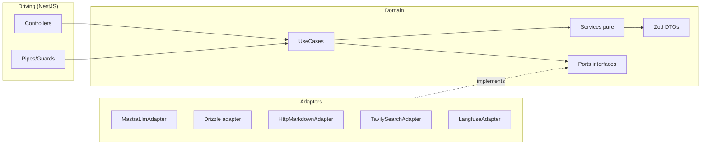
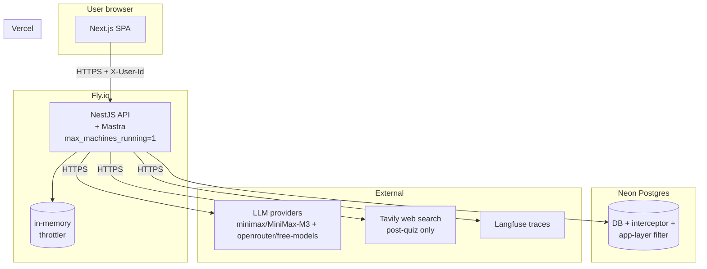
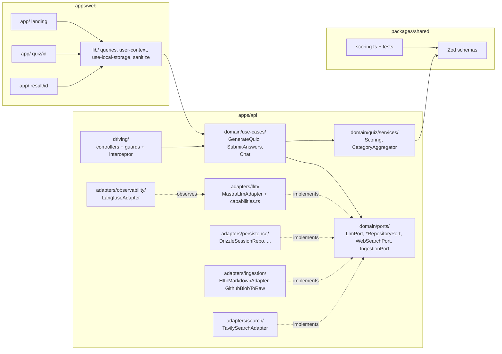
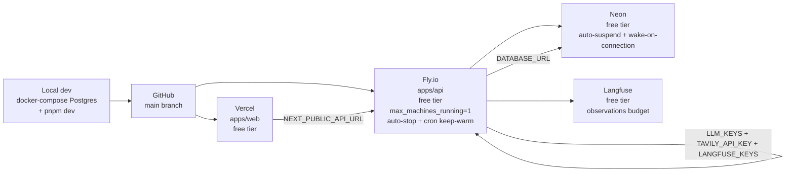

# Architecture Spine — ai-quiz

The invariant contract that all downstream epics and stories inherit verbatim. **29 ADs** (15 retained unchanged + 4 amended + 10 new; AD-6 + AD-11 removed) distilled from the **audited PRD** (`prds/prd-ai-quiz-2026-07-16/prd.md`) + the implementation reference (`specs/architecture-spec.md`) + the constitution (`project-context.md`). Regenerated 2026-07-18 to replace the stale pre-audit spine (AD-9 RLS, AD-11 HMAC, AD-19 `node:20`, old scoring formula — all superseded); updated 2026-07-19 with RLS v1 default, FR-12/FR-13 removal, MiniMax default, mobile first-class, content-density check, tooling conventions.

The SPEC archive at `_bmad-output/archive/SPEC-2026-07-16.md` is **frozen and not authoritative**. The PRD wins on any conflict.

## Design Paradigm

**Hexagonal architecture (a.k.a. ports-and-adapters)** for the API; **MVC-by-feature** for the web.

The API's dependency direction is the load-bearing rule: domain → ports → use-cases, with adapters and the NestJS driving layer as the only callers into the domain. Every cross-boundary value is a Zod-inferred DTO, frozen at construction. The web follows Next.js App Router conventions; LLM-bearing logic lives only in the API, never in the browser bundle.

API layers:

| Layer | Path | Imports allowed | Imports forbidden |
|---|---|---|---|
| domain | `apps/api/src/domain/` | other domain code, Zod, type-only | NestJS, Drizzle, Mastra, undici, `node:fetch` |
| ports | `apps/api/src/domain/ports/` | domain types, Zod | adapters, NestJS |
| use-cases | `apps/api/src/domain/use-cases/` | domain + ports + Zod | adapters, NestJS |
| adapters | `apps/api/src/adapters/` | port interfaces + external SDKs | domain internals |
| driving (NestJS) | `apps/api/src/driving/` | use-cases + adapters (composition root) | domain internals |

Web layers:

| Layer | Path | Responsibility |
|---|---|---|
| app/ | Next.js App Router pages | Routing + composition |
| components/ | React components | UI + presentation logic |
| lib/ | Hooks + utilities | API wrapper, query factory, contexts, sanitize |



## Inherited Invariants

None — this is the root spine at `initiative` altitude. Downward epics/stories inherit these ADs verbatim.

## Invariants & Rules

> **Binds** = the FR/NFR this AD governs. **Prevents** = the divergence this AD stops. **Rule** = the constraint downstream must follow.

### AD-1 — Hexagonal Architecture `[ADOPTED]`

- **Binds:** `apps/api/src/*` (entire backend), FR-1–FR-17.
- **Prevents:** domain logic coupled to NestJS/Drizzle/Mastra; cross-boundary types duplicated.
- **Rule:** `domain/`, `ports/`, `use-cases/` are pure; `adapters/` and `driving/` hold all I/O.

### AD-2 — Domain purity `[ADOPTED]`

- **Binds:** `apps/api/src/domain/*` + all use-cases.
- **Prevents:** I/O leaking into pure logic; tests becoming slow/integration-y.
- **Rule:** Enforced by ESLint `no-restricted-imports` against `@nestjs/*`, `drizzle-orm`, `mastra`, `undici`, `node:fetch`. The domain is an isolated **directory** (`apps/api/src/domain/`) with its own `tsconfig.json` — not a separate pnpm package. Domain code may not import from `apps/api/src/adapters/`, `apps/api/src/driving/`, or any external I/O library. Vitest in-domain unit tests must run in <100ms (no I/O).

### AD-3 — Zod DTOs at every boundary (canonical pattern)

- **Binds:** HTTP→domain, domain→adapter, adapter→domain.
- **Prevents:** `any`/`unknown` leaking across layers; runtime shape drift; domain code coupled to drizzle/raw types; silent shape drift between DB columns and Zod schemas.
- **Rule (canonical adapter-method pattern):** Every adapter wraps raw I/O results in `Object.freeze(Schema.parse(raw))` before returning. Domain code never sees raw `unknown`, raw drizzle types, or unvalidated shapes. The schema used is the Zod schema for that entity from `packages/shared/src/schemas.ts`.

```ts
// adapters/persistence/drizzle/sessionRepo.ts
import { eq, and } from 'drizzle-orm';
import { QuizSessionSchema, type QuizSessionDto } from '@ai-quiz/shared/schemas';
import type { SessionRepositoryPort } from 'domain/ports/sessionRepositoryPort';

export class DrizzleSessionRepository implements SessionRepositoryPort {
  async findByIdAndUserId(sessionId: string, userId: string): Promise<QuizSessionDto | null> {
    const rows = await this.db
      .select()
      .from(quizSessions)
      .where(and(
        eq(quizSessions.id, sessionId),
        eq(quizSessions.userId, userId)
      ))
      .limit(1);
    if (rows.length === 0) return null;
    // ← parse + freeze happens INSIDE the adapter, before returning
    return Object.freeze(QuizSessionSchema.parse(rows[0]));
  }
}
```

- **Direction:** raw I/O (drizzle rows, HTTP request bodies, LLM JSON responses) crosses the boundary one way only — inbound → parsed → frozen → domain. Domain operates on parsed, frozen DTOs.
- **One schema per boundary:** the Zod schema in `packages/shared/src/schemas.ts` is the single source of truth for the entity's shape. It validates (a) DB rows on read, (b) HTTP bodies on write (via `ZodValidationPipe` in the driving layer), (c) LLM JSON outputs on the LLM adapter side. If the schema changes, all three boundaries change together.
- **Frozen DTOs:** `Object.freeze(...)` is mandatory. Use cases receive `Readonly<DTO>`-equivalent values; any attempt to mutate throws in strict mode. Prevents accidental shared-state bugs.
- **No mapping layer:** the DTO is the universal currency. There is no separate `entities/` layer; we don't map entity ↔ DTO between adapter and domain. (See addendum B for trade-offs and when this pattern breaks down.)

### AD-4 — LLM untrusted

- **Binds:** Every adapter that calls an LLM (FR-2, FR-3, FR-4, FR-9, FR-11, FR-13, FR-15).
- **Prevents:** Malformed JSON, refusal strings, injection-shaped strings reaching persistence/UI.
- **Rule:** Zod `safeParse` + **2 retries** (best-effort providers — Ollama) / **1 retry** (strict-mode — default `minimax/MiniMax-M3`). `UntrustedLlmOutputError` on final failure; session marked `failed`.

### AD-5 — LlmPort is the only outbound LLM boundary

- **Binds:** All LLM-touching code.
- **Prevents:** Bypass of capability map, caching, retry, output validation.
- **Rule:** Use-cases never import from `adapters/llm/*` directly. `LlmPort` (`apps/api/src/domain/ports/LlmPort.ts`) is the sole outbound LLM boundary.

### AD-6 — Provider-agnostic via Mastra (with capability matrix) `[AMENDED 2026-07-18]`

- **Binds:** LLM adapter, runtime config, FR-4, FR-14.
- **Prevents:** Hardcoded provider SDK in domain; per-provider auth leaks; missing capability flags.
- **Rule (v1 scope — MiniMax + OpenRouter free):** Two provider tiers. Default is MiniMax-M3; OpenRouter free models are opt-in via the FE dropdown. Model string is `'provider/model'` (e.g. `'minimax/MiniMax-M3'`, `'openrouter/meta-llama/llama-3.3-70b-instruct:free'`). MiniMax wired via inline `url` form (not a built-in Mastra provider); OpenRouter via the built-in Mastra `openrouter` adapter. Provider capability matrix lives in `adapters/llm/capabilities.ts` and governs every LLM call. **Matrix essentials (verified 2026-07-19):**
  - **MiniMax:** model ID is **`MiniMax-M3`** (hyphen, not space). M3 supports **auto caching only** (no explicit `cache_control`); M2.x supports explicit. Round-trip `reasoning_details` via `extra_body={"reasoning_split": true}` (OpenAI-compat) or full `content[]` array with `thinking` + `signature` blocks (Anthropic-compat).
  - **OpenRouter free models:** filtered by `pricing.prompt = "0"`. Example model IDs: `meta-llama/llama-3.3-70b-instruct:free`, `google/gemini-2.0-flash-exp:free`, `qwen/qwen-2.5-72b-instruct:free`, `mistralai/mistral-small-3.1-24b-instruct:free`. Catalog may rotate — capability matrix pulls live list from `https://openrouter.ai/api/v1/models?free=true`. Free-tier calls fall back to MiniMax-M3 transparently on failure (single retry).
  - **Default:** `minimax/MiniMax-M3` (flagship; 1M context; auto caching only). `temperature` and `top_p` are **fully supported** on M3.
  - **MiniMax regional:** `MINIMAX_REGION=intl` switches to `api.minimax.io`; mainland China is default (`api.minimaxi.com`).
  - **Provider filtering:** `GET /api/config/providers` returns only providers whose env keys are set. Default-deny. In v1 this returns `{minimax: [...models], openrouter: [...free models]}` when both keys are set; `[]` when neither is set.

### AD-7 — Mastra catch-all MUST be last

- **Binds:** `apps/api/src/app.module.ts`, FR-4.
- **Prevents:** Catch-all `@All('*')` shadowing all NestJS controllers (returns 404 for every endpoint).
- **Rule:** `MastraModule.register({mastra})` is the last entry in `AppModule.imports`. Integration test asserts every NestJS route resolves. Comment above the import explains the constraint.

### AD-8 — Runtime constraints `[ADOPTED]`

- **Binds:** `apps/api` runtime, deploy target.
- **Prevents:** Mastra integration failure; silent Fastify incompatibility.
- **Rule:** Node `>= 22.13.0` (pin in `package.json` `engines`); `@nestjs/platform-express` as direct dep; Fastify forbidden.

### AD-9 — Ownership per request + Postgres RLS (v1) `[AMENDED 2026-07-18, 2026-07-19, 2026-07-19]`

- **Binds:** All session-scoped endpoints, FR-8, §10.1.
- **Prevents:** IDOR; cross-user data leak.
- **Rule (v1 — four-layer enforcement, updated 2026-07-19):** RLS was previously deferred to v2; **upgraded to v1 default** based on user direction. The full pattern:
  1. `@OwnsSession()` interceptor validates `X-User-Id` is UUID v4 (cheap format check, no DB query).
  2. Interceptor opens a transaction and `SET LOCAL app.user_id = '<uuid>'` once per request, propagated via **AsyncLocalStorage** so the use-case's Drizzle queries share the same connection + transaction. (A separate Drizzle connection would not see the GUC, and queries would return 0 rows silently.)
  3. Every use-case calls `sessionRepo.findByIdAndUserId(sessionId, userId)` and throws `NotFoundError` → **404** (not 403) for both not-found and not-owned.
  4. All session-scoped queries filter by `session_id` (the child tables have no `user_id` column directly; everything goes through `quiz_sessions`).
  5. **Postgres RLS as the database-layer half** — function-based + `FORCE ROW LEVEL SECURITY`. Every owned table has a policy that joins to `quiz_sessions` via `EXISTS` and checks `s.user_id = current_session_user_id()`. **Mandatory:** every table needs `ENABLE` + `FORCE ROW LEVEL SECURITY` (Neon's table-owner role bypasses RLS without `FORCE`). The lint rule and RLS are both required — either alone is insufficient.
- **Postgres RLS migration (v1, function-based):**
  ```sql
  CREATE OR REPLACE FUNCTION current_session_user_id() RETURNS uuid
  LANGUAGE sql STABLE AS $$ SELECT current_setting('app.user_id', true)::uuid $$;

  ALTER TABLE quiz_sessions        ENABLE ROW LEVEL SECURITY;
  ALTER TABLE documents            ENABLE ROW LEVEL SECURITY;
  ALTER TABLE questions            ENABLE ROW LEVEL SECURITY;
  ALTER TABLE answers              ENABLE ROW LEVEL SECURITY;
  ALTER TABLE user_responses       ENABLE ROW LEVEL SECURITY;
  ALTER TABLE insights             ENABLE ROW LEVEL SECURITY;
  ALTER TABLE knowledge_categories ENABLE ROW LEVEL SECURITY;
  ALTER TABLE chat_messages        ENABLE ROW LEVEL SECURITY;
  -- FORCE on each — required for Neon's table-owner role
  ALTER TABLE quiz_sessions        FORCE ROW LEVEL SECURITY;
  ALTER TABLE documents            FORCE ROW LEVEL SECURITY;
  -- (etc. for every owned table)

  CREATE POLICY user_owns_session ON quiz_sessions
    USING (user_id = current_session_user_id());

  CREATE POLICY user_documents ON documents
    USING (
      EXISTS (
        SELECT 1 FROM quiz_sessions s
        WHERE s.id = documents.session_id
        AND s.user_id = current_session_user_id()
      )
    );

  -- (similar for questions, answers, user_responses, insights, knowledge_categories, chat_messages)
  ```
- **Why `FORCE ROW LEVEL SECURITY` matters:** without it, the Neon table-owner role bypasses RLS entirely — the policies would be advisory only. The interceptor's `SET LOCAL` + the FORCE flag are **both** required; either alone is insufficient.
- **Cost:** function-based policies add a subquery (`EXISTS (...)`) to every session-scoped read. At v1 scale the cost is negligible (a few µs per query). The subquery uses the same `idx_quiz_sessions_user_id_created_at` index as the app-layer `WHERE user_id = ?` filter.
- **Companion dev-time enforcement:** CI lint rule `@ai-quiz/no-unscoped-session-query` — fails the build if any `WHERE session_id = ?` clause appears outside a `forUser*` context or without an explicit `assertUserOwns(sessionId, userId)` call. Lint catches the failure mode at dev time so it never gets to RLS; RLS catches at runtime if lint was bypassed (e.g. raw SQL outside ESLint's reach).

### AD-10 — SSRF defense with expanded IP blocklist `[ADOPTED]`

- **Binds:** `IngestionPort`, FR-1.
- **Prevents:** SSRF to RFC1918 + CGN (`100.64/10`) + Oracle IMDS (`192.0.0/24`) + benchmarking (`198.18/15`) + multicast + reserved + IPv6 ULA + 6to4 (`2002::/16`); IPv4-mapped IPv6 bypass; IDN homograph; HTTP/0.9 smuggling; zip-bomb OOM.
- **Rule:** Scheme allowlist `https:`/`http:` only; hostname blocklist (`localhost`, `0.0.0.0`, `metadata.google.internal`, `metadata.amazonaws.com`); `net.isIP()` for literals (handles short-form `127.1`, `0`, decimal); normalize `::ffff:a.b.c.d` → `a.b.c.d` before RFC1918 check; DNS-pin-then-validate; bind undici `Agent` to validated IP; reject punycode mismatch (IDN homograph); reject HTTP/0.9 responses; disable redirects; rewrite GitHub `blob` → `raw` before fetch; **tiered size limits (10 MB HTTP body / 2 MB decoded markdown / ~500 KB token-estimated)**; 10 s timeout; `text/markdown`/`text/plain` only.

### AD-12 — Chat pre-submit guard `[ADOPTED]`

- **Binds:** `POST /api/sessions/:id/chat`, FR-9.
- **Prevents:** Answer-exfiltration before submit.
- **Rule:** Use-case checks `status`. `ChatUseCase` receives **redacted** `QuestionDto` (no `is_correct`, no question text) when `status='ready'`; full DTO when `status='submitted'`. Unit test asserts redacted DTO shape.

### AD-13 — Tavily dual-LLM sanitization

- **Binds:** `WebSearchPort` implementation; chat flow with tools, FR-11.
- **Prevents:** Tool-result poisoning (indirect prompt injection).
- **Rule:** Tavily results summarized by a secondary LLM call to ≤ 200 chars before being added to main agent context. Summarizer cannot invoke tools; raw HTML/markdown never crosses the boundary; summarizer uses a different provider than the main agent when possible.

### AD-14 — Drizzle-only persistence

- **Binds:** All DB-touching code.
- **Prevents:** SQL injection; data-access duplication.
- **Rule:** No other ORMs / raw `pg` client. Migrations via `drizzle-kit`. `sql` template tag uses `$1/$2` placeholders. TLS required (`?sslmode=require` for Neon). `statement_timeout: 10_000`, `query_timeout: 15_000`.

### AD-15 — Submit idempotency + inline results+insights

- **Binds:** `POST /api/sessions/:id/submit`, FR-7.
- **Prevents:** Double-scoring on retry/duplicate POST; lost responses; round-trip for a separate insights endpoint; UI requiring two renders of related data.
- **Rule:**
  - **`UNIQUE(session_id, question_id)` on `user_responses`.** Atomic state transition `UPDATE quiz_sessions SET status='submitted' WHERE id=? AND status='ready' RETURNING ...`. Concurrent submits return cached result: if the atomic UPDATE returns 0 rows and `status` is `'submitted'`, the use-case re-SELECTs the existing `user_responses` + recomputes the score from DB (deterministic from inputs) and returns the same payload shape. **Never 5xx on duplicate submit** — clients must be able to retry safely.
  - **Single response shape** — `POST /submit` returns `{finalScore, breakdown[], categoryBreakdown[], insights: {topicsToStudy[], weakCategories[], strengthByCategory}}`. The insights are computed at submit time (synchronously via `CategoryAggregatorService` + `rankWeakCategories` per AD-16) and returned inline. **No `POST /api/sessions/:id/insight` endpoint exists** — gap analysis is delivered through this single response, and the same `insights` object is loaded into the chat LLM context per FR-10 so chat can answer gap-analysis questions conversationally.
  - **Result UI renders one page** showing both `breakdown` + `insights` together; no "Analyze gaps" button needed since `insights` is already on screen.

### AD-16 — Multi-answer scoring (clamped, miss-cancels) `[AMENDED 2026-07-18]`

- **Binds:** `packages/shared` scoring module, FR-6, FR-10.8.
- **Prevents:** Multi-answer questions scoring full marks when wrong picks are present; NaN from empty input; scoring-integrity defects in the core deliverable.
- **Rule:**
  - **Multi-answer:** `clamp(round(4 × (hits − misses) / |correct|, 2), 0, 4)` where `hits = |correct ∩ selected|`, `misses = |selected \ correct|`.
    - **Fully-correct** → 4. **Empty** → 0. **Hit + miss** → 0. **Select-all (or any over-selection) → 0** (math: `hits − misses = 0`).
    - **Lower clamp is load-bearing** (handles negative-before-clamp from over-selection). Upper clamp is float-safety only.
    - Throws on `n<=0` (no correct answers).
  - **Single:** 4 iff sets equal, else 0.
  - `type='single'` requires exactly 1 correct; `type='multiple'` requires 2..4 correct. Validated at the LLM-output boundary.
  - Positions validated as unique integers in `[0, 3]`.
  - 8-question geometric weights sum to **11.4358881**, not 12.
  - Categories compare by `avgRawScore` (NOT `weightedScore` — position-biased, not comparable across categories).
  - Strength thresholds: `>=3.0` strong, `>=1.6 AND <3.0` mixed, `<1.6` weak. Boundaries are exclusive of overlap.
- **Why this changed:** the archived `round(4 × |correct ∩ selected| / |correct|, 2)` ignored wrong selections, so selecting all 4 options scored **full marks on every `multiple` question**. Wrong picks must cancel right ones.

### AD-17 — FE state split `[ADOPTED]`

- **Binds:** `apps/web` state management, FR-5.
- **Prevents:** State store bloat; SSR hydration mismatches; cross-component prop drilling.
- **Rule:** No Zustand, no Redux. TanStack Query v5 for server state (query-keys factory in `apps/web/lib/queries.ts`). React Context (UUID, theme) + `useState` per-component + custom `useLocalStorage` hook. UUID generated in `<head>` inline script **before** React hydrates (avoids first-request race).

### AD-18 — Lazy SDK loading

- **Binds:** `apps/api/src/adapters/llm/*`.
- **Prevents:** 256 MB Fly free-tier OOM; 150 MB baseline from loading 5 SDKs.
- **Rule:** Default provider (`minimax/MiniMax-M3`) loaded eagerly; others via `await import(...)` in `MastraLlmAdapter` per call. `/api/health` exposes `process.memoryUsage()` in non-prod.

### AD-19 — Deploy topology `[AMENDED 2026-07-18]`

- **Binds:** Deployment + cost ceiling, §10.6, FR-16.
- **Prevents:** Build-breaking Node version; rate-limiter correctness on N machines; violating $0/mo mandate; deploy-day outages.
- **Rule:** Vercel (web) + Fly.io (API) + Neon (DB). `fly secrets set` for secrets + Vercel per-env. Migrations via `fly.toml` `release_command` (`node dist/main.js migrate`). **Base image `node:22-slim`** — Mastra requires Node `>= 22.13.0`, so `node:20-slim` fails `engines` and breaks the API in prod. **`max_machines_running = 1` is REQUIRED** — the in-memory rate limiter (AD-N7) is only correct on a single machine. Provider SDKs dynamic-imported on first use (AD-18) — avoids 256 MB OOM. Auto-stop Fly machines with external cron ping `/healthz` every 4 min (free tier has no `min_machines_running=1`). Two health endpoints: `/healthz` (process-alive, ~1 ms) vs `/api/health` (deep-checks DB + providers).

### AD-20 — Two health endpoints

- **Binds:** Fly healthcheck + monitoring.
- **Prevents:** Fly kill-loop when Neon is cold; monitoring blind to provider outages.
- **Rule:** `GET /healthz` is process-alive (~1 ms), used by Fly healthcheck (timeout 30 s, grace 60 s, interval 30 s). `GET /api/health` deep-checks DB + provider reachability, used by monitoring. Drizzle init wrapped in 5-attempt retry loop with exponential backoff.

### AD-N1 — FR-15: Ingest neutralization + output grounding `[NEW 2026-07-18]`

- **Binds:** FR-15; §10.1; §10.4 (testing).
- **Prevents:** Prompt injection steering the model; LLM-rewrite inducing double-spend; rendered HTML/markdown reaching the browser; secret-shaped tokens leaking from the source; ungrounded (off-document) questions.
- **Rule:** Ingested markdown is **inert data**. It is never executed. Exactly two execution surfaces let it act: (a) the generator LLM (content integrity risk) and (b) the chat agent's tool loop (bounded: one read-only tool, ≤ 2 iterations, no secrets/PII/auth in context — accepted).
  - **Ingest-side (deterministic, no LLM):** NFKC normalize; strip C0/C1 control chars (except `\t \n \r`); strip zero-width chars (U+200B, U+200C, U+200D, U+FEFF, etc.) and bidi control chars (U+202A–U+202E, U+2066–U+2069) — the Trojan Source class. Strip `<script>` blocks, event handlers (`onclick=`, `onerror=`, `onload=`, etc.), `<iframe>` / `<frame>` / `<object>` / `<embed>` / `<applet>`, `<meta http-equiv>`, `javascript:` / `data:text/html` URIs in `href` / `src`, base64 data-URI blobs (`data:image/...;base64,...`, `data:application/pdf;base64,...`). **Preserve** HTML comments, link titles, image alt text, all other raw HTML formatting (`<kbd>`, `<sup>`, `<sub>`, `<details>`, etc.), and **code blocks** — highest-value quiz material.
  - **Never LLM-rewrite the source document.** A rewrite pass is itself injectable (same trust boundary, no new boundary), costs a full doc pass on the critical path, and destroys the fidelity quizzes need (exact API names, flags, versions, code).
  - **Output-side (constrain shape, don't filter keywords):**
    1. **Structured output is the containment** — Zod schema. An injection saying "emit `<script>`" only puts a string in `question.text`; it cannot escape.
    2. **Q/A render as plain text, never markdown/HTML.** `{text}` auto-escapes. DOMPurify is scoped to explanations + chat only (with `rel="noopener noreferrer"` on `target="_blank"`).
    3. **Grounding check** — reject questions with no meaningful token overlap against any source chunk. **On grounding failure: retry the whole generation call** consistent with the AD-4 retry budget (2 retries for best-effort providers, 1 for strict-mode); after retries exhausted, raise `UntrustedLlmOutputError` and mark the session `failed`. Do NOT partially accept or drop questions — that creates inconsistent scoring.
    4. **Secret-shaped-token check relative to source** — output matching `sk-[A-Za-z0-9]{20,}`, `AKIA…`, or long high-entropy strings **not present in the source doc** → retry (same budget as grounding).
  - **Removed by the 2026-07-16 audit:** `outputLooksUnsafe()` keyword blocklist (`DROP TABLE` / `password` / `<script>` / `api_key`) — false-positived on exactly the DB/security READMEs this app targets while protecting nothing the controls above don't already cover. A quiz answer containing `DROP TABLE` is harmless when it renders as plain text and is grounded in the source. Also removed: the heuristic "ignore previous instructions" regex (theatre; replaced by neutralization + grounding).

### AD-N2 — FR-16: Bounded critical path + closed-world generation `[NEW 2026-07-18]`

- **Binds:** FR-16; all session generation; AD-19 (deploy topology); project-context §"Quiz generation flow".
- **Prevents:** Critical-path bloat from subagent orchestration; LLM calls outside the knowledge base (Tavily during gen) that would invalidate the grounding check; Fly auto-stop killing correctness-dependent work.
- **Rule:**
  - **Sync path to `status='ready'`:** `fetch → neutralize (AD-N1) → chunk by headings → select ~8k-token chunk budget → 1 structured LLM call (questions + categories together) → persist → return`. Chunking stays sync — it's a **prerequisite** for generation and costs milliseconds.
  - **Async after response** (`void enrich(sessionId)`): full doc + chunk persistence, chat cache prefix, `knowledge_categories` aggregates, Langfuse flush. **No queue, no Redis, no BullMQ.**
  - **Invariant:** enrichment is an **optimization, NEVER a correctness dependency.** If Fly auto-stop kills it mid-flight, consumers (chat, gap-analysis) recompute on demand. Never write code that assumes enrichment ran.
  - **Map-reduce removed entirely.** Modern models (MiniMax-M3: 1M, Sonnet 5: 1M, Opus 4.8: 1M, GPT-5.x: 200k+, gpt-oss-20b: 131k) handle real READMEs in one shot. Map-reduce was complexity tax for a non-problem and was the pre-audit design's timeout risk.
  - **`max_machines_running = 1` is REQUIRED** for both the in-memory rate limiter (AD-N7) and this async-enrichment invariant to hold. With N machines, the in-memory store is wrong and an auto-stopped machine can leave enrichment uncomputed.
  - **Generation is closed-world: NO Tavily / web search during gen.** Tavily is confined to insight + chat, both post-quiz. The grounding check (AD-N1 rule 3) is only meaningful because generation is closed over the ingested document.

### AD-N3 — FR-16: Doc-size guard (tiered limits, plus content-density check) `[NEW 2026-07-18]`

- **Binds:** FR-16; architecture-spec §A.6 step 1–2; AD-10 (size limits inside the SSRF defense).
- **Prevents:** Zip-bomb OOM during streaming decode; burning LLM calls on docs that exceed the chosen model's context window; silent fallback that masks user error.
- **Rule:**
  - **HTTP body cap: 10 MB** (defensive; prevents zip-bomb OOM).
  - **Decoded markdown text cap: 2 MB** — covers essentially all real-world documents (kubernetes README ~50 KB; large tutorial ~500 KB; entire docs page 1–2 MB). Hard `400 DOC_TOO_LARGE` before LLM call.
  - **Token-estimated cap: ~500 KB of text ≈ 125k tokens** — well below all current model context windows. Acts as a UX shortcut to reject clearly-too-large docs before burning an LLM call.
  - **Per-model context-window check** — if the doc exceeds the chosen model's context window, return `400 DOC_TOO_LARGE` with `{"hint": "switch provider/model — e.g. MiniMax-M3 supports 1M tokens"}`. The user picks a larger-context model. **No silent fallback, no map-reduce.**
  - **Content-density check (doc too short)** — if the document's estimated quiz-able content is too small for the requested `questionCount` (heuristic: `doc_tokens / questionCount < ~500` tokens/question), return `400 DOC_TOO_SHORT` with `{"hint": "reduce questionCount — this document has ~Xk tokens of quiz-able content"}`. Rejects with a clear message rather than padding with filler questions.
  - Exceeding any cap → `400 DOC_TOO_LARGE` (too big) or `400 DOC_TOO_SHORT` (too small) with the appropriate hint.

### AD-N4 — FR-2: Strategy (user-picked) + category selection (LLM pool, random subset) `[NEW 2026-07-18]`

- **Binds:** FR-2; FR-3 (single structured-output call); architecture-spec §A.6 steps 5–7.
- **Prevents:** LLM silently choosing the learning style; deterministic category sets (no replay value); uneven question distribution; `topic` becoming a prompt-injection vector.
- **Rule:**
  - `strategy` is **REQUIRED** in `POST /api/sessions` (enum: `factual | comprehension | mixed | trivia`). The LLM uses it as a prompt modifier — `factual` emphasizes recall, `comprehension` emphasizes "why/how", `mixed` mixes types, `trivia` emphasizes unusual facts. **No silent default; no LLM proposal.**
  - **`topic` is a bounded free-text hint, max 200 chars** — NOT injected into the LLM prompt as instructions (it's a hint, not an instruction; prevents it becoming a prompt-injection vector).
  - **Category pool:** LLM proposes 6–10 candidate categories from the document's headings/sections (deterministic per `(document, model)` so retries are stable).
  - **Selection:** system **randomly picks 4–6** from the pool per quiz. Different runs of the same URL produce different category mixes — adds replay value.
  - **Even distribution:** questions distributed evenly across the selected categories (count per category differs by ≤ 1).
  - All four properties enforced via Zod schema (strategy enum; selected category subset of pool) + structured-output validation (question.category ∈ selected subset; per-category count tolerance).

### AD-N5 — FR-17: Complete submissions only `[NEW 2026-07-18]`

- **Binds:** FR-17; `weightedFinalScore` contiguous-position invariant; AD-16 (scoring).
- **Prevents:** Undefined `weightedFinalScore` behavior on incomplete submissions; downstream NaN propagation; the `scoreQuestion` empty-selection branch becoming reachable from the UI.
- **Rule:**
  - `POST /api/sessions/:id/submit` must carry **exactly one response per session question**, with the question-ID set matching the session's set exactly.
  - Missing or extra IDs → **400**.
  - **Server resolves `position` from `questions.position` by `question_id`**, NOT from the request array index. Request array order is irrelevant — this prevents silent misapplication of geometric weights if the client reorders.
  - This is what makes `weightedFinalScore`'s contiguous-position invariant (positions 0..n-1, no gaps) hold **by construction**. `scoreQuestion` keeps its empty-selection → 0 branch for API robustness even though the UI cannot produce it.

### AD-N6 — REMOVED 2026-07-19

The insight guard AD is **deleted** in this regen. FR-12 (per-question insight) and FR-13 (separate gap-analysis endpoint) were both removed 2026-07-19. Gap analysis is delivered through the chat thread (FR-10) since the chat LLM context includes the session's precomputed `topicsToStudy[]` and category aggregates. The Result page UI renders results + insights inline (single API call to `/submit` returns both — see AD-15). No `POST /api/sessions/:id/insight` endpoint exists. The AD-N6 row is removed from the Capability Map; FR-13 is marked REMOVED there.

### AD-N7 — Rate limiting (per-user AND per-IP, stricter wins; no HMAC) `[NEW 2026-07-18]`

- **Binds:** §10.2; every authenticated endpoint; replaces AD-11 (HMAC binding removed).
- **Prevents:** Per-user rate-limit bypass via UUID rotation; HMAC forgery (browser had to compute it → secret shipped client-side → forging was free); the "10× budget increase" from a looser IP fallback.
- **Rule:**
  - UUID v4 validated at boundary (canonical v4 Zod regex): `X-User-Id` matches `^[0-9a-f]{8}-[0-9a-f]{4}-4[0-9a-f]{3}-[89ab][0-9a-f]{3}-[0-9a-f]{12}$` — the loose 8-4-4-4-12 accepts v1/v2/v3/v5/v6/v7 too and defeats the random-UUID assumption; pin to v4-only.
  - Every route limited **twice**: once keyed by `X-User-Id`, once keyed by source IP, **same table, stricter wins**. No HMAC. No separate IP-only fallback looser than the per-user limit.
  - **Limits** (per-user / per-IP whichever is stricter):

    | Endpoint | Limit |
    |---|---|
    | Global | 30/min |
    | `POST /api/sessions` | 5/min (LLM call) |
    | `POST /api/sessions/:id/insight` | 10/min |
    | `POST /api/sessions/:id/chat` | 20/min |

  - 429 response with `Retry-After` header.
  - **In-memory store accepted ONLY with `max_machines_running = 1`** (per AD-19) — otherwise the table is fragmented across machines and the "stricter wins" invariant breaks. Switch to Redis (Upstash free) only if the deploy ever scales out.
  - **Removed:** the "5 req/sec/IP" fallback from AD-11 — it was looser than the 30/min per-user limit it backed (300/min vs 30/min), giving a UUID-rotating attacker a 10× budget. Mirroring the per-route table onto the IP key closes that hole.
  - The IP key is the real control, since `X-User-Id` is forgeable and HMAC binding was removed.

### AD-N8 — CORS `NODE_ENV` gate `[NEW 2026-07-18]`

- **Binds:** §10.1; every authenticated endpoint; replaces the `x-vercel-environment` gate.
- **Prevents:** Vercel previews exposed in production; the `x-vercel-environment: production` header check (that header lives inside Vercel's runtime and never reaches Fly from a cross-origin browser request, so it could not function).
- **Rule:**
  - **Exact `WEB_ORIGIN` always allowed.**
  - **`WEB_ORIGIN_REGEX`** (e.g., `^https://.*\.vercel\.app$` for Vercel previews) allowed **only when `NODE_ENV !== 'production'`**. In production, exact origin only.
  - CORS methods: `GET, POST`. Headers: `Content-Type, X-User-Id, X-User-Hmac` (the last is kept for back-compat with older clients; the throttler ignores it per AD-N7). `maxAge: 600`.

## Consistency Conventions

| Concern | Convention |
|---|---|
| Naming (entities, files, interfaces, events) | kebab-case files; PascalCase classes; camelCase vars; `*.dto.ts` for DTOs; `*.port.ts` for ports; `*.adapter.ts` for adapters |
| Data & formats (ids, dates, error shapes, envelopes) | UUIDs everywhere (`uuid_generate_v4()`); ISO 8601 timestamps; jsonb for nested structures (`chunks`, `sources`, `selected`, `tool_calls`, `thinking`, `payload`) |
| State & cross-cutting (mutation, errors, logging, config, auth) | Mutation via Drizzle only; errors via domain exception classes; structured logging via pino with redaction; config via env vars + `fly secrets`; auth via `X-User-Id` (anonymous UUID; rate-limited twice: per-user + per-IP, stricter wins) |
| HTTP envelope | `{error: {code, message, requestId}}` on failure; **404 (not 403) for cross-user access**; 429 with `Retry-After`; `400 DOC_TOO_LARGE` with `hint` for size-cap failures |
| Plain-text Q/A render | Question + answer text render as plain text, never markdown/HTML (`{text}` auto-escapes). DOMPurify scoped to explanations + chat only |
| Per-session cost budget | **REMOVED 2026-07-19** — no `cost_spent` column, no per-session guard. Cost control via free-tier provider caps + rate limits only. |
| **Linting (v1)** | **ESLint flat config** (`eslint.config.js`) at repo root. Mandatory custom rules: `@ai-quiz/no-unscoped-session-query` (fails build if `WHERE session_id = ?` appears outside a `forUser*` context or without `assertUserOwns(sessionId, userId)` call — catches the ownership-filter failure mode at dev time); `@ai-quiz/require-data-testid` (fails build if interactive elements lack `data-testid`); `@ai-quiz/no-console-log` outside `apps/api/src/adapters/`. TypeScript ESLint plugin for type-aware rules. `simple-import-sort` (or `eslint-plugin-import`) for import order. |
| **Formatting (v1)** | **Prettier 3.x** with config at repo root (`.prettierrc`). Runs on pre-commit via `lint-staged` + `husky`. Runs on pre-push + CI via `pnpm format:check`. Single source of formatting truth — no per-package overrides. |
| **TypeScript (v1)** | `tsconfig.base.json` shared, per-package override. `strict: true` + `noUncheckedIndexedAccess: true` + `noImplicitOverride: true` always on. `pnpm typecheck` = `tsc --noEmit` per package. |
| **Scripts (v1)** | Root `package.json`: `pnpm dev` (parallel all workspaces); `pnpm build` (incremental tsc); `pnpm test` (Vitest all packages); `pnpm test:e2e` (Playwright); `pnpm format` / `format:check`; `pnpm lint` / `lint:fix`; `pnpm db:migrate` / `db:generate` (Drizzle); `pnpm typecheck`. `pnpm verify` is the CI gate = `lint:check && typecheck && test && test:e2e && build`. |
| Zod field length caps | `question.text ≤ 500`, `explanation ≤ 2_000`, `chat.content ≤ 8_000` chars |
| SHA-256 document hashing at ingest | `documents.content_hash` is SHA-256; tampering detectable |
| Tests | Vitest for unit + integration + security; Playwright + POM for E2E; `data-testid` on every interactive element; tests use `getByTestId(...)` only |

### AD-N9 — Observability (Langfuse + pino redaction) `[NEW 2026-07-18]`

- **Binds:** §10.3; every LLM call; every HTTP request/response.
- **Prevents:** LLM prompts leaking PII to Langfuse cloud; secrets in pino logs; cost over-runs invisible to operators.
- **Rule:**
  - **Langfuse:** every LLM call traced (provider, model, prompt, completion, latency, tokens, cache hit/miss, session_id, user_id, request_id). **Chat message content is scrubbed after 7 days** via a cron job; only metadata (model, tokens, latency) is retained long-term.
  - **pino redaction (deny-list with allowlist):** `Authorization`, `x-api-key`, `cookie`, `x-user-id`, `req.body.*`, all `*_KEY` and `*_SECRET` env vars, `*.apiKey`. **Allowed for logging:** `timestamp`, `level`, `msg`, `requestId`, `route`, `status`, `latency_ms`, `user_id_hash` (SHA-256 of UUID, not the raw UUID).
  - **Per-session cost tracking:** **REMOVED 2026-07-19** — no `cost_spent` column, no per-session cost guard. Cost control is via free-tier provider rate limits (MiniMax-M3: 20 RPM / 1M TPM; OpenRouter free models have their own caps) + the rate limiter (§10.2) only.
  - **Health endpoints (AD-20):** `/healthz` is process-alive (~1ms, used by Fly); `/api/health` deep-checks DB + provider reachability + memory + in-memory rate-limiter health; `/api/health` is never in the public path.

### AD-N10 — Testing discipline (Vitest + Playwright + Page Object Model) `[NEW 2026-07-18]`

- **Binds:** §10.4; every PR; every change to `apps/api/`, `apps/web/`, `packages/shared/`.
- **Prevents:** Regressions in scoring, security controls, or session lifecycle; flaky E2E tests; untested edge cases in neutralization or idempotency.
- **Rule:**
  - **Vitest** for `packages/shared/test/` (scoring module unit tests, 100% coverage of `geometricWeights` / `scoreQuestion` / `weightedFinalScore` / `aggregateByCategory` / `rankWeakCategories` / `strengthFor`) + `apps/api/test/` (use-case + adapter + security tests, including the SSRF blocklist, the chat-pre-submit guard, the ownership-404 distinction, and the size-tier guard).
  - **Playwright + Page Object Model** for `apps/web/e2e/` (`landing.spec.ts`, `full-quiz.spec.ts`, `chat.spec.ts`, `security.spec.ts`). POM classes in `apps/web/e2e/pages/`.
  - **Selector discipline:** every interactive element gets `data-testid="..."` at the component level. Tests use `getByTestId(...)` only — no CSS or text selectors. **CI lint step enforces this** (eslint rule rejects components lacking `data-testid` on `<button>`, `<input>`, `<a>`).
  - **Run order** in CI: `pnpm --filter @ai-quiz/shared test && pnpm --filter @ai-quiz/api test && pnpm --filter @ai-quiz/web test:e2e`. Vitest must complete in <30s on a single CI runner; Playwright in <2min.
  - **Coverage floor:** scoring module ≥ 95%; use-cases ≥ 80%; adapters ≥ 60% (some hard-to-test I/O paths are exempt).
  - **Test results include gap analysis + insights** — Vitest and Playwright suites output not just pass/fail but also the category gap analysis and any captured insights as part of the standard test pass. There is no separate test run for these; they're produced as a side-effect of running the suite. Implementation: a Vitest reporter hook + a Playwright `testInfo` annotation pull gap data from `quiz_sessions` (post-submit fixtures).

## Stack

**Verified 2026-07-19** via `pnpm view <pkg> version` and provider docs.

| Name | Version | Verified |
|---|---|---|
| pnpm | 9.x (workspaces) | — |
| Node.js | `>= 22.13.0` (pinned in `package.json engines`; Docker base `node:22-slim`) | — |
| TypeScript | 5.x | — |
| NestJS | 11.1.28 | `pnpm view @nestjs/core version` 2026-07-19 |
| @nestjs/platform-express | 11.1.28 (matches NestJS minor) | `pnpm view @nestjs/platform-express version` 2026-07-19 |
| @nestjs/throttler | 6.x | — |
| @mastra/core | `^1.50.0` (currently 1.51.0) | `pnpm view @mastra/core version` 2026-07-19 |
| @mastra/nestjs | 0.2.7 (peer: `@mastra/core ^1.50.0`, `@nestjs/core ^10 \|\| ^11`) | `pnpm view @mastra/nestjs version` 2026-07-19 |
| Drizzle ORM | 0.30+ | — |
| Postgres (Neon) | 16 | — |
| Next.js | 15 (App Router) | — |
| Tailwind | 4.3.3 (Oxide engine, CSS-first; v4 is a major rewrite from v3) | `pnpm view tailwindcss version` 2026-07-19 |
| shadcn/ui | (latest) | — |
| motion (renamed from framer-motion Nov 2024) | 12.42.2 — import from `motion/react` not `framer-motion` | `pnpm view motion version` 2026-07-19 |
| TanStack Query | 5.x | — |
| Zod | 4.4.3 | `pnpm view zod version` 2026-07-19 |
| Langfuse SDK | latest | — |
| pino | 9.x | — |
| DOMPurify | latest (scoped to explanations + chat only) | — |
| Vitest | 4.1.10 | `pnpm view vitest version` 2026-07-19 |
| Playwright | 1.4x | — |
| Vercel (web) | free tier | — |
| Fly.io (api) | free tier; `max_machines_running = 1` required |
| Neon (db) | free tier |

## Structural Seed

### System view



### Container / module view



### Core entity ERD

```mermaid
erDiagram
  users ||--o{ quiz_sessions : "owns"
  quiz_sessions ||--|| documents : "has source"
  quiz_sessions ||--o{ questions : "contains"
  quiz_sessions ||--o{ user_responses : "collects"
  quiz_sessions ||--o{ insights : "produces"
  quiz_sessions ||--o{ chat_messages : "threads"
  quiz_sessions ||--o{ knowledge_categories : "aggregates"
  questions ||--o{ answers : "has 4"
  questions ||--o{ user_responses : "scored by"
  chat_messages }o--o{ questions : "may anchor to"

  users {
    uuid id PK
    text external_id "browser UUID, unique"
    timestamptz created_at
  }
  quiz_sessions {
    uuid id PK
    uuid user_id FK
    text source_url
    text topic "nullable hint, max 200"
    text strategy "factual|comprehension|mixed|trivia"
    text provider "minimax|openrouter"
    text model "provider/model"
    text status "pending|ready|submitted|failed"
    text error_message "nullable, set when status='failed'"
    int question_count
    numeric final_score "nullable"
    timestamptz created_at
    timestamptz completed_at
  }
  questions {
    uuid id PK
    uuid session_id FK
    int position "0-based"
    text text "max 500 chars"
    text type "single|multiple"
    text category "LLM-assigned, in selected subset, hidden during quiz"
    text explanation "nullable, max 2000 chars, post-hoc"
  }
  answers {
    uuid id PK
    uuid question_id FK
    int position "0..3"
    text text
    bool is_correct "NEVER returned to FE pre-submit"
  }
  user_responses {
    uuid id PK
    uuid session_id FK
    uuid question_id FK
    jsonb selected "int[]"
    numeric raw_score "0..4"
    numeric weight
    numeric weighted_score
    timestamptz submitted_at
  }
  documents {
    uuid id PK
    uuid session_id FK
    text url
    text content_markdown
    text content_hash "SHA-256"
    jsonb chunks
    int byte_size
    int token_estimate
    timestamptz ingested_at
  }
  insights {
    uuid id PK
    uuid session_id FK
    text kind "gap_analysis"
    jsonb payload
    jsonb sources
    timestamptz created_at
  }
  knowledge_categories {
    uuid id PK
    uuid session_id FK
    text name
    int question_count
    int correct_count
    numeric avg_raw_score
    numeric weighted_score
    text strength "strong|mixed|weak"
    UNIQUE_session_id_name "UNIQUE (session_id, name)"
  }
  chat_messages {
    uuid id PK
    uuid session_id FK
    uuid question_id FK "nullable anchor"
    text role "user|assistant"
    text content "max 8000 chars"
    jsonb sources "nullable"
    jsonb tool_calls "nullable"
    text model "nullable"
    jsonb thinking "nullable, MiniMax-M3 reasoning_details"
    timestamptz created_at
    INDEX_session_id_created_at "INDEX (session_id, created_at)"
  }
```

### Minimal source tree

```text
ai-quiz/
  apps/
    api/
      src/
        main.ts                          # bootstrap, helmet, cors, throttler, exception filter
        app.module.ts                    # imports: ... MastraModule LAST (AD-7)
        domain/
          quiz/
            dto/                         # QuestionDto, SubmissionDto, ScoreDto, InsightDto, CategoryPerformanceDto
            entities/                    # typed value objects
            services/                    # ScoringService, CategoryAggregatorService (pure)
            errors/                      # UntrustedLlmOutputError, SsrfBlockedError, DocTooLargeError
          ports/
            LlmPort.ts
            DocumentRepositoryPort.ts
            QuizRepositoryPort.ts
            UserRepositoryPort.ts
            WebSearchPort.ts
            IngestionPort.ts
          use-cases/
            GenerateQuizUseCase.ts       # FR-2, FR-3, FR-15, FR-16
            SubmitAnswersUseCase.ts      # FR-6, FR-7, FR-17
            RequestInsightUseCase.ts     # REMOVED in 2026-07-19 — gap analysis via chat (FR-10)
            ChatUseCase.ts               # FR-9, FR-10, FR-11
        adapters/
          llm/
            capabilities.ts              # PROVIDER_CAPABILITIES map (per AD-6)
            MastraLlmAdapter.ts          # lazy SDK load (AD-18), grounding check (AD-N1)
            providers/                   # minimax + openrouter free (v1 scope)
          persistence/
            drizzle/                     # repos per port; sql template tag uses $1/$2
          ingestion/
            ssrf-safe-fetch.ts           # per AD-10
            GithubBlobToRaw.ts
            neutralize.ts                # AD-N1 ingest scrub
            chunker.ts                   # sync heading-based chunker
          search/
            TavilySearchAdapter.ts       # dual-LLM summarization (AD-13), post-quiz only
          observability/
            LangfuseAdapter.ts
        driving/
          sessions/                      # controllers + DTO validation + throttler (per-user + per-IP)
          insights/
          users/
          config/                        # GET /config/providers (default-deny, AD-6)
          health/                        # /healthz (process-alive) + /api/health (deep)
          middleware/
            user-id.middleware.ts        # validates UUID v4
            own-session.interceptor.ts   # @OwnsSession guard + app-layer WHERE user_id
            user-throttler.guard.ts      # AD-N7
        test/                            # vitest unit + integration + security
      drizzle/                           # migrations
      Dockerfile                         # node:22-slim multi-stage
      fly.toml                           # release_command runs migrations; max_machines_running=1
    web/
      app/
        page.tsx                         # landing + history sidebar
        quiz/[id]/page.tsx
        result/[id]/page.tsx             # dual-panel
        layout.tsx                       # UserProvider inline UUID script
      components/{ui,quiz,history}/
      lib/
        api.ts                           # fetch wrapper (X-User-Id injection)
        queries.ts                       # TanStack Query hooks + query-keys factory
        user-context.tsx                 # UUID Context
        use-local-storage.ts             # persisted prefs hook
        sanitize.ts                      # DOMPurify wrapper (scoped)
      e2e/
        pages/                           # BasePage, LandingPage, QuizPage, ResultPage (POM)
        fixtures/
        tests/                           # landing.spec.ts, full-quiz.spec.ts, chat.spec.ts, security.spec.ts
  packages/
    shared/
      src/
        schemas.ts                       # Zod schemas for all DTOs
        scoring.ts                       # geometricWeights, scoreQuestion (AD-16), weightedFinalScore, aggregateByCategory, strengthFor
        dto.ts                           # re-exports frozen DTOs
      test/
        scoring.test.ts                  # Vitest: n=0/1/8, all-correct, select-all=0, hit+miss cancel, NaN guard, rounding
  docker-compose.yml                     # local Postgres
  .env.example
  pnpm-workspace.yaml
  README.md
```

### Deployment topology



## Capability → Architecture Map

| PRD Capability / FR | Lives in | Governed by |
|---|---|---|
| FR-1 SSRF-safe ingest | `adapters/ingestion/ssrf-safe-fetch.ts` + `driving/sessions` | AD-10 |
| FR-2 Strategy (user-picked) + category selection (LLM pool, random subset) | `domain/use-cases/GenerateQuiz` + `adapters/llm/MastraLlmAdapter` | AD-1, AD-4, AD-5, AD-6, AD-N4 |
| FR-3 LLM question generation (single call) | `adapters/llm/MastraLlmAdapter` (with `LlmPort.generateQuiz`) | AD-4, AD-5, AD-6, AD-16, AD-N2, AD-N4 |
| FR-4 Provider-agnostic adapter | `adapters/llm/MastraLlmAdapter` + `adapters/llm/capabilities.ts` | AD-6, AD-18 |
| FR-5 Quiz UI | `apps/web/app/quiz/[id]` + `apps/web/lib/queries.ts` | AD-17 |
| FR-6 Geometric-weighted scoring | `packages/shared/scoring.ts` + `domain/use-cases/SubmitAnswers` | AD-16 |
| FR-7 Idempotent submission + inline results + insights | `domain/use-cases/SubmitAnswers` + Postgres constraint; `domain/quiz/services/CategoryAggregatorService` computes insights inline at submit time | AD-15, AD-16 |
| FR-8 Per-endpoint ownership | `driving/middleware/own-session.interceptor.ts` + app-layer `WHERE user_id = ?` (tested by `apps/api/test/security/ownership.test.ts` — cross-user returns 404) | AD-9 |
| FR-9 Chat pre-submit guard | `domain/use-cases/Chat` | AD-12 |
| FR-10 Chat persistence (free text, context includes submit-time insights) | `adapters/persistence/drizzle` + `chat_messages` schema | AD-14 |
| FR-11 Tavily tool-calling | `adapters/search/TavilySearchAdapter` + LLM adapter tool loop | AD-13 |
| FR-13 Gap analysis (whole-quiz `gap_analysis` only) | **REMOVED 2026-07-19** — gap analysis delivered via chat (FR-10), no separate endpoint. `domain/quiz/services/CategoryAggregatorService` still computes the gap data at submit time; the chat LLM prompt includes it as context. | — |
| FR-14 Provider list endpoint | `driving/config` + `apps/web/lib/queries` | AD-6, AD-17 |
| **FR-15 Ingest neutralization + output grounding** | `adapters/ingestion/neutralize.ts` + `adapters/llm/MastraLlmAdapter` (grounding + secret-shaped-token check) | **AD-N1** |
| **FR-16 Bounded critical path + doc-size guard** | `domain/use-cases/GenerateQuiz` (sync) + `adapters/llm/MastraLlmAdapter` (lazy SDK load) + `adapters/ingestion/chunker.ts` | **AD-N2, AD-N3, AD-18, AD-19** |
| **FR-17 Complete submissions only** | `domain/use-cases/SubmitAnswers` + Postgres constraint | **AD-N5, AD-15** |
| §10.1 Security (SSRF, ownership, chat/insight guards, ingest neutralization, grounding, CORS, pino redaction) | `driving/middleware/{ssrf-block-list,own-session.interceptor,user-throttler.guard,safe-exception.filter}.ts` + `adapters/ingestion/ssrf-safe-fetch.ts` + `adapters/llm/MastraLlmAdapter.ts` | AD-9, AD-10, AD-12, AD-N1, AD-N7, AD-N8 |
| §10.2 Rate limiting | `driving/middleware/user-throttler.guard.ts` + `@nestjs/throttler` | AD-N7, AD-19 |
| §10.3 Observability | `adapters/observability/LangfuseAdapter` + `adapters/observability/pino-redaction.ts` | AD-N9 |
| §10.4 Testing discipline | `apps/api/test/` (unit + integration + security) + `apps/web/e2e/` (Playwright + POM) + `packages/shared/test/` (scoring) | AD-N10 |
| §10.5 FE state | `apps/web/lib/{queries,user-context,use-local-storage}` | AD-17 |
| §10.6 Deploy | Dockerfile (`node:22-slim`), `fly.toml` (`max_machines_running=1`, release_command), Vercel config, `docker-compose.yml` | AD-19, AD-20 |
| §10.7 Provider rules | `adapters/llm/capabilities.ts` | AD-6 |
| §10.8 Scoring math | `packages/shared/scoring.ts` | AD-16, AD-N5 |

## Deferred

| Decision | Reason it can wait |
|---|---|
| **OQ-1 MiniMax default vs. opt-in** | **RESOLVED 2026-07-18:** Default is `minimax/MiniMax-M3` (user-specified). Groq is opt-in via provider dropdown. MiniMax free tier (20 RPM / 1M TPM) supports the v1 use case. |
| **OQ-2 Mobile gating** | **RESOLVED 2026-07-19**: Mobile is a first-class v1 surface. Dual-panel → tabs collapse on narrow viewports; history sidebar collapses to slide-out; chat input is mobile-friendly. No "best on desktop" notice. |
| **OQ-3 < 5 questions case** | Pad with `"general"` template questions only with user opt-in; otherwise return fewer questions with an `actualCount` field surfaced in the UI. |
| Streaming SSE for chat | Sync HTTP acceptable for v1; would require SSE plumbing across API + FE + tests. Revise if `SM-1` cold-start latency exceeds 30 s in pilot. |
| Real auth (OAuth/Auth.js) | UUID identity is sufficient for anonymous v1 demo. |
| Mobile-native apps | Out of scope per brief; web-responsive is enough. |
| CI/CD pipelines | Manual deploys for v1. Add GitHub Actions when scope grows. |
| i18n / non-English docs | UI strings + LLM prompts English-only by design. |
| Per-user cost limits (quota UI) | **REMOVED 2026-07-19** — free-tier provider caps + rate limits (§10.2) are the only cost-control surface. |
| Workspace-level Anthropic cache coordination | Each Fly machine has its own cache (since Feb 2026 Anthropic workspace isolation); single-machine fine for v1. |
| Multi-region Fly deployment | Single region on free tier; pin session affinity if multi-instance. The single-machine constraint (`max_machines_running=1`, AD-19/AD-N7) must be relaxed first. |
| Streaming Langfuse traces | Batch HTTP flush is fine for v1. |
| EU/US data residency for user-generated docs | PII model: anonymous UUID, no PII in docs. Defer until enterprise scope. |
| Per-question insight endpoint | **RESOLVED 2026-07-19** (FR-12 removed): there is no per-question insight endpoint. Per-question follow-up is conversational via chat (FR-10) with `questionId` anchor. |
| `outputLooksUnsafe()` keyword blocklist | Removed by audit (AD-N1) — false-positived on DB/security READMEs. Replaced by grounding + secret-shaped-token check. |
| Custom BMad agents (e.g. AI-Boundary-Security-Reviewer) | Use TEA + finalize_reviewers; add via BMB only if patterns repeat. |

## Handoffs

- **To `bmad-create-epics-and-stories`:** Use this spine as the invariant contract. Break the **15 active FRs** (17 minus FR-12 and FR-13) and 8 NFRs into epics + stories. Each story must cite the FR/NFR and the ADs it must respect. Do not reintroduce AD-9 RLS-as-deferred, AD-11 HMAC, AD-19 `node:20`, or the pre-audit scoring formula — all superseded.
- **To `bmad-check-implementation-readiness`:** Verify that the PRD §4/§10, this spine, and the stories are aligned. Flag any story that contradicts an AD or encodes a removed rule.
- **To `bmad-sprint-planning`:** Use the build order in architecture-spec §A.12 as a starting dependency graph; story dependencies will refine it.

## Final Notes

- **2026-07-18: Spine regenerated** from audited PRD (`prds/prd-ai-quiz-2026-07-16/prd.md`) + implementation reference (`specs/architecture-spec.md`) + `project-context.md`. The previous spine (`status: STALE-PRE-AUDIT`) is superseded and replaced, not extended.
- **Removed:** AD-9 RLS portion, AD-11 HMAC binding entirely (replaced by AD-N7), AD-19 `node:20` (replaced by `node:22`), AD-16 old formula (replaced by clamped miss-cancels).
- **Added:** 10 new ADs (since 2026-07-18 regen) — AD-N1 ingest neutralization + grounding · AD-N2 bounded critical path · AD-N3 doc-size guard · AD-N4 strategy + category selection · AD-N5 complete submissions · AD-N6 insight guard (**REMOVED 2026-07-19** — gap analysis via chat) · AD-N7 rate limiting · AD-N8 CORS gate · AD-N9 observability · AD-N10 testing discipline. Provider capability matrix absorbed into AD-6. ERD updated for `gap_analysis`-only insight + `error_message` column on `quiz_sessions`. Mermaid + source tree comments purged of stale HMAC / RLS / `node:20` references.
- **Binds:** 15 active FRs (FR-1..17 except FR-12 and FR-13) + 8 NFRs + all Resolved Ambiguities from `.memlog.md`.
- Original `SPEC.md` is archived at `_bmad-output/archive/SPEC-2026-07-16.md` and is **not authoritative**. The PRD + this spine are.
